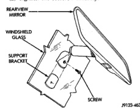

# REMOVAL AND INSTALLATION (Continued)

## FLOOR CARPET OR MAT-CLUB CAB (Continued)

### REMOVAL (Continued)

(6) Remove quarter trim panels.

(7) Fold carpet or mat toward center of cab.

(8) Remove carpet or mat through door opening.

### INSTALLATION

Reverse the preceding operation.

## REARVIEW MIRROR

### REMOVAL

(1) Loosen the mirror base setscrew (Fig. 120).

(2) Slide the mirror base upward and off the bracket.

### INSTALLATION

(1) Position the mirror base at the bracket and slide it downward onto the support bracket.

(2) Tighten the setscrew securely.

*Fig. 120 Rearview Mirror]*

## REARVIEW MIRROR SUPPORT BRACKET

### INSTALLATION

(1) Mark the position for the mirror bracket on the outside of the windshield glass with a wax pencil.

(2) Clean the bracket contact area on the glass. Use a mild powdered cleanser on a cloth saturated with isopropyl (rubbing) alcohol. Finally, clean the glass with a paper towel dampened with alcohol.

(3) Sand the surface on the support bracket with fine grit sandpaper. Wipe the bracket surface clean with a paper towel.

(4) Apply accelerator to the surface on the bracket according to the following instructions:
- Crush the vial to saturate the felt applicator.
- Remove the paper sleeve.
- Apply accelerator to the contact surface on the bracket.
- Allow the accelerator to dry for five minutes.
- Do not touch the bracket contact surface after the accelerator has been applied.

(5) Apply adhesive accelerator to the bracket contact surface on the windshield glass. Allow the accelerator to dry for one minute. Do not touch the glass contact surface after the accelerator has been applied.

(6) Install the bracket according to the following instructions:
- Apply one drop of adhesive at the center of the bracket contact surface on the windshield glass.
- Apply an even coat of adhesive to the contact surface on the bracket.
- Align the bracket with the marked position on the windshield glass.
- Press and hold the bracket in place for at least one minute.

**NOTE:** Verify that the mirror support bracket is correctly aligned, because the adhesive will cure rapidly.

(7) Allow the adhesive to cure for 8-10 minutes. Remove any excess adhesive with an alcohol-dampened cloth.

(8) Allow the adhesive to cure for an additional 8-10 minutes before installing the mirror.

## SUN VISOR

**NOTE:** All vehicles with driver and passenger side airbags must have a color-coded, 5-bullet point airbag warning label applied to the sunvisor face surface (in the stored position). When replacing the sunvisor, verify label availability and ensure the label is installed.

### REMOVAL

(1) Remove screws attaching sun visor to roof (Fig. 121).

(2) If equipped, disengage lighted vanity mirror connector.

(3) Separate sun visor from roof.

(4) Remove screw attaching sun visor hook to roof.

(5) Separate sun visor hook from roof.

### INSTALLATION

(1) Position sun visor hook on roof.

(2) Install screw attaching sun visor hook to roof.

(3) Position sun visor on roof.

(4) If equipped, engage lighted vanity mirror connector.

(5) Install screws attaching sun visor to roof (Fig. 121).

---
*Source: Chapter 23 Body, Page 63*
