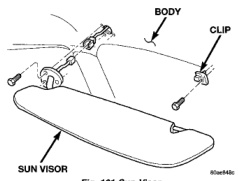
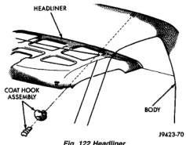
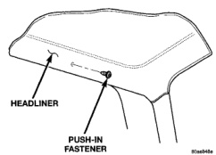

# REMOVAL AND INSTALLATION (Continued)

## SUN VISOR (Continued)

*Fig. 121 Sun Visor]*

## HEADLINER

### REMOVAL

(1) Remove sun visors and visor hooks.

(2) Remove overhead assist handle.

(3) Remove coat hook(s).

(4) Remove overhead console, if equipped. Refer to Group 8V, Overhead Console for removal procedure.

(5) Remove A-pillar trim.

(6) Remove quarter trim panels.

(7) Remove dome lamp. Refer to Group 8L, Lamps for removal procedure.

(8) If equipped, disengage push-in fasteners attaching headliner to roof panel (Fig. 123).

(9) If equipped, remove upper latch striker cover.

(10) Separate headliner from roof panel (Fig. 122).

(11) Extract headliner through door opening.

*Fig. 122 Headliner]*

*Fig. 123 Headliner Push-In Fasteners]*

### INSTALLATION

(1) Position headliner on roof panel (Fig. 122).

(2) Install passenger side sun visor hook.

(3) Install:
- (a) Driver's side coat hook-BR vehicles.
- (b) Driver's side rear push-in fasteners-BE vehicles.

(4) Install driver side sun visor hook.

(5) Install right rear push-in fastener-BE vehicles.

(6) Install left and right side coat hooks-BE vehicles.

(7) Install dome lamp.

(8) Install push-in fasteners on each side of dome lamp-BE vehicles.

(9) If equipped, install upper latch striker cover.

(10) Install quarter trim panels.

(11) Install A-pillar trim.

(12) Install overhead console, if equipped. Refer to Group 8V, Overhead Console for installation procedure.

(13) Install overhead assist handle.

(14) Install sun visors.

## OVERHEAD ASSIST HANDLE

### REMOVAL

(1) Disengage tabs attaching assist handle end covers to assist handle.

(2) Remove screws attaching overhead assist handle to roof rail (Fig. 124).

(3) Separate overhead assist handle from vehicle.

### INSTALLATION

Reverse the preceding operation.

(1) Position assist handle on vehicle.

(2) Install screws attaching overhead assist handle to roof rail (Fig. 124).

(3) Install tabs attaching assist handle end covers to assist handle.

## COAT HOOK

### REMOVAL

(1) Grasp both sides of the coat hook base and firmly pull outward to disengage the coat hook cover from the base (Fig. 125).

---
*Source: Chapter 23 Body, Page 64*
