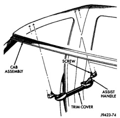
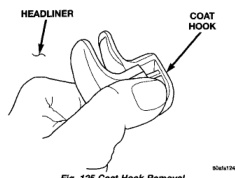
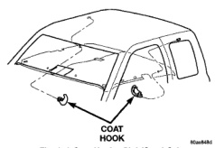

# REMOVAL AND INSTALLATION (Continued)

## COAT HOOK (Continued)

*Fig. 124 Overhead Assist Handle]*

(2) Pull coat hook out of roof panel (Fig. 126).

*Fig. 125 Coat Hook Removal]*

*Fig. 126 Coat Hook-Club/Quad Cab]*

### INSTALLATION

(1) Position coat hook in roof panel.

(2) Push the coat hook cover inward and secure the coat hook to the roof panel.

# ADJUSTMENTS

## HOOD

(1) Loosen the hinge arm-to-hood panel bolts at each side of the vehicle.

(2) Loosen the hood latch screws.

(3) Close the hood. Adjust the fore/aft position.

(4) Raise the hood. Tighten the hinge arm-to-hood panel bolts.

(5) Tighten the latch screws.

(6) Lower the hood. Inspect clearance between the hood and the cowl cover.

## HOOD LATCH STRIKER

(1) Open the hood.

(2) Loosen the latch striker screws.

(3) Slowly close the hood and observe the latching operation.

(4) As necessary, re-adjust the striker position. Tighten the screws.

## HOOD LATCH

(1) Open the hood.

(2) Loosen the hood latch screws.

(3) Move the latch to the correct location and lightly tighten the screws.

(4) Close the hood slowly and observe the latching operation.

(5) As necessary, re-adjust the latch position and tighten the screws.

## FRONT DOOR LATCH

(1) Insert a hex-wrench through the elongated hole in the door end frame near the latch striker opening (Fig. 127).

(2) Loosen torx head screw on the side of the latch linkage.

(3) Lift upward on outside door handle and release it.

(4) Tighten torx head screw on latch.

(5) Verify latch operation.

---
*Source: Chapter 23 Body, Page 65*
