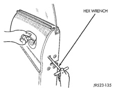
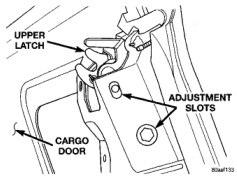

# ADJUSTMENTS (Continued)

*Fig. 127 Door Latch Adjustment]*

## FRONT DOOR FORE/AFT

Fore/aft (lateral) door adjustment is done by loosening the hinge to cowl screws one hinge at a time. Then move the door to the correct position.

(1) Support the door with a padded floor jack.

(2) Loosen the hinge to cowl screws. If necessary, refer to the front door hinge removal/installation procedure for hinge fastener location. Move the door to the correct fore/aft position.

(3) Tighten the hinge to cowl screws.

(4) Remove the floor jack from the door.

## FRONT DOOR IN/OUT

In/out door adjustment is done by loosening the hinge to door fasteners. Then move the door to the correct position.

(1) Support the door with a padded floor jack.

(2) Loosen the applicable hinge to door fasteners. Move the door to the correct in/out position.

(3) If necessary, loosen the other hinge to door fasteners and move the door to the correct in/out position.

(4) Tighten the hinge to door fasteners.

(5) Remove the floor jack from the door.

## FRONT DOOR UP/DOWN

Up/down door adjustment is done by loosening the hinge to cowl fasteners at both hinges. Then move the door to the correct position.

(1) Support the door with a padded floor jack.

(2) Loosen hinge to cowl fasteners at both hinges. Move the door to the correct up/down position.

(3) Tighten the hinge to cowl fasteners.

(4) Remove the floor jack from the door.

## CARGO DOOR

### CARGO DOOR FORE/AFT AND UP/DOWN

(1) As applicable, remove the C-pillar trim to access the bolts attaching the cargo door to the C-pillar.

(2) Support the door with a padded floor jack.

(3) Loosen the applicable C-pillar to hinge bolts and move the door to the correct position.

If necessary, loosen the other C-pillar to hinge bolts and move the door to the correct position.

(4) Tighten the bolts to 28 N·m (21 ft. lbs.) torque.

(5) If necessary, loosen the bolts attaching the lower striker and move striker to the correct position.

If necessary, loosen the bolts attaching the upper latch to the cargo door and move to the correct position (Fig. 128).

*Fig. 128 Cargo Door Upper Latch]*

### CARGO DOOR IN/OUT

(1) Loosen the applicable hinge to door fasteners and move the door to the correct position.

(2) Tighten the bolts to 28 N·m (21 ft. lbs.) torque.

---
*Source: Chapter 23 Body, Page 66*
