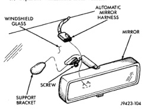

# STATIONARY GLASS

## INDEX

| Section | Page |
|---------|------|
| DESCRIPTION AND OPERATION | |
| Safety Precautions | 6 |
| REMOVAL AND INSTALLATION | |
| Backlite | 8 |
| Sliding Backlite | 9 |
| Sliding Backlite Latch and Keeper | 10 |
| Sliding Vent Glass | 9 |
| Windshield | 6 |

## DESCRIPTION AND OPERATION

### SAFETY PRECAUTIONS

**WARNING: DO NOT OPERATE THE VEHICLE WITHIN 24 HOURS OF WINDSHIELD INSTALLATION. IT TAKES AT LEAST 24 HOURS FOR URETHANE ADHESIVE TO CURE. IF IT IS NOT CURED, THE WINDSHIELD MAY NOT PERFORM PROPERLY IN AN ACCIDENT.**

**URETHANE ADHESIVES ARE APPLIED AS A SYSTEM. USE GLASS CLEANER, GLASS PREP SOLVENT, GLASS PRIMER, PVC (VINYL) PRIMER AND PINCHWELD (FENCE) PRIMER PROVIDED BY THE ADHESIVE MANUFACTURER. IF NOT, STRUCTURAL INTEGRITY COULD BE COMPROMISED.**

**CHRYSLER DOES NOT RECOMMEND GLASS ADHESIVE BY BRAND. TECHNICIANS SHOULD REVIEW PRODUCT LABELS AND TECHNICAL DATA SHEETS, AND USE ONLY ADHESIVES THAT THEIR MANUFACTURES WARRANT WILL RESTORE A VEHICLE TO THE REQUIREMENTS OF FMVSS 212. TECHNICIANS SHOULD ALSO INSURE THAT PRIMERS AND CLEANERS ARE COMPATIBLE WITH THE PARTICULAR ADHESIVE USED.**

**BE SURE TO REFER TO THE URETHANE MANUFACTURER'S DIRECTIONS FOR CURING TIME SPECIFICATIONS, AND DO NOT USE ADHESIVE AFTER ITS EXPIRATION DATE.**

**VAPORS THAT ARE EMITTED FROM THE URETHANE ADHESIVE OR PRIMER COULD CAUSE PERSONAL INJURY. USE THEM IN A WELL-VENTILATED AREA.**

**SKIN CONTACT WITH URETHANE ADHESIVE SHOULD BE AVOIDED. PERSONAL INJURY MAY RESULT.**

**ALWAYS WEAR EYE AND HAND PROTECTION WHEN WORKING WITH GLASS.**

**CAUTION:** Protect all painted and trimmed surfaces from coming in contact with urethane or primers.

Be careful not to damage painted surfaces when removing moldings or cutting urethane around windshield.

It is difficult to salvage a windshield during the removal operation. The windshield is part of the structural support for the roof. The urethane bonding used to secure the windshield to the fence is difficult to cut or clean from any surface. If the moldings are set in urethane, it would also be unlikely they could be salvaged. Before removing the windshield, check the availability of the windshield and moldings from the parts supplier.

## REMOVAL AND INSTALLATION

### WINDSHIELD

#### REMOVAL

(1) Remove inside rear view mirror (Fig. 1).

(2) Remove cowl cover. Refer to Cowl Cover Removal paragraph in this group.

(3) With doors open, remove windshield molding (Fig. 2). Pull outward on molding beginning at the bottom of A-pillars using pliers.

(4) Cut urethane bonding from around windshield using a suitable sharp cold knife (C-4849). A pneumatic cutting device can be used but is not recommended (Fig. 3).

(5) Separate windshield from vehicle.

*Fig. 1 Rear View Mirror]*

---
*Chapter 23 Body, Page 6*
