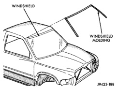
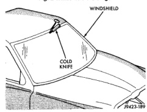

# REMOVAL AND INSTALLATION (Continued)

*Fig. 2 Windshield Moldings]*

*Fig. 3 Cut Urethane Around Windshield]*

#### INSTALLATION

**WARNING:** Allow the urethane at least 24 hours to cure before returning the vehicle to use.

**CAUTION:** Roll down the left and right front door glass and open the rear glass slider (if available) before installing windshield to avoid pressurizing the passenger compartment if a door is slammed before urethane is cured. Water leaks can result.

The windshield fence should be cleaned of most of its old urethane bonding material. A small amount of old urethane, approximately 1-2 mm in height, should remain on the fence. Do not grind off or completely remove all old urethane from the fence, the paint finish and bonding strength will be adversely affected. Support spacers should be cleaned and properly installed on weld stud or repair screws at bottom of windshield opening.

(1) Place replacement windshield into windshield opening and position glass in the center of the opening against the support spacers. Mark the glass at the support spacers with a grease pencil or pieces of masking tape and ink pen to use as a reference for installation. Remove replacement windshield from windshield opening (Fig. 4).

(2) Position the windshield inside up on a suitable work surface with two padded, wood 10 cm by 10 cm by 50 cm (4 in. by 4 in. by 20 in.) blocks, placed parallel 75 cm (2.5 ft.) apart (Fig. 5).

(3) Clean inside of windshield with MOPAR Glass Cleaner and lint-free cloth.

(4) Apply clear glass primer 25 mm (1 in.) wide around perimeter of windshield and wipe with a new clean and dry lint-free cloth.

(5) Apply the molding to the windshield:
- Press the upper corners of the molding onto the windshield.
- Press the header section onto the windshield.
- Press the A-Pillar sections onto the windshield.

(6) Apply black-out primer onto the glass using the windshield molding as a guide. The primer should be 15 mm (5/8 in.) wide on the top and sides of the glass and 25 mm (1 in.) on the bottom of windshield. Allow at least three minutes drying time.

(7) Position one 5 mm (3/16 in.) soft spacer (p/n 55028214) at the bottom of the windshield fence (Fig. 6).

(8) Apply a 13mm (1/2 in.) high and 10mm (3/8 in.) wide bead of urethane around the perimeter of windshield. At the bottom, apply the bead 7 mm (1/4 in.) inboard from the glass edge. On the three sides where the molding is on the glass, follow the edge of molding. The urethane bead should be shaped in a triangular cross-section, this can be achieved by notching the tip of the applicator (Fig. 7).

(9) With the aid of a helper, position the windshield over the windshield opening. Align the reference marks at the bottom of the windshield to the support spacers.

(10) Slowly lower windshield glass to the fence opening guiding the lower corners into proper position. Beginning at the bottom and continuing to the top, push glass onto fence along the A-Pillars. Push windshield inward to the fence at the bottom corners (Fig. 8).

(11) Clean excess urethane from exterior with MOPAR Super Clean or equivalent.

(12) Apply 150 mm (6 in.) lengths of 50 mm (2 in.) masking tape spaced 250 mm (10 in.) apart to hold molding in place until urethane cures.

(13) Install cowl cover and wipers.

(14) Install inside rear view mirror.

(15) After urethane has cured, remove tape strips and water test windshield to verify repair.

---
*Chapter 23 Body, Page 7*
