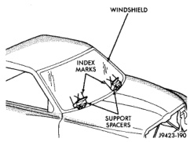
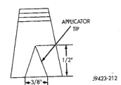
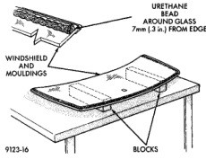
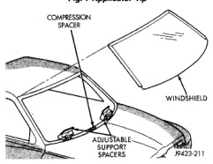
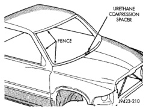

# REMOVAL AND INSTALLATION (Continued)

*Fig. 4 Center Windshield and Mark at Support Spacers]*

*Fig. 5 Work Surface Set up and Molding Installation]*

*Fig. 6 Position Urethane Compression Spacer]*

*Fig. 7 Applicator Tip]*

*Fig. 8 Lower Windshield Into Position]*

### BACKLITE

#### REMOVAL

It is difficult to salvage the backlite during the removal operation. The backlite is part of the structural support for the roof. The urethane bonding used to secure the glass to the fence is difficult to cut or clean from any surface. Since the molding is set in urethane, it is unlikely it would be salvaged. Before removing the backlite, check the availability from the parts supplier.

The backlite is attached to the window frame with urethane adhesive. The urethane adhesive is applied cold and seals the surface area between the window opening and the glass. The primer adheres the urethane adhesive to the backlite.

(1) Roll down door glass.

(2) If necessary, remove quarter trim panels.

(3) Remove headliner.

(4) Remove cab back panel trim.

(5) Bend rear window retaining tabs inward against glass.

(6) Using a suitable pneumatic knife from inside the vehicle, cut urethane holding rear glass frame to opening fence.

(7) Separate glass from vehicle.

---
*Chapter 23 Body, Page 8*
