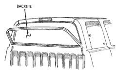
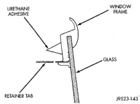
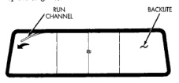
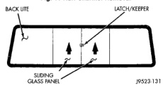

# REMOVAL AND INSTALLATION (Continued)

#### INSTALLATION

(1) Clean urethane adhesive from around rear glass opening fence.

(2) Apply black-out primer to outer edge of replacement rear glass frame.

(3) Apply black-out primer to rear glass opening fence.

(4) Apply a 13 mm (0.5 in.) bead of urethane around the perimeter of the window frame bonding surface (Fig. 9).

(5) Set glass on lower fence and move glass forward into opening (Fig. 10).

(6) Firmly push glass against rear window glass opening fence.

(7) Bend tabs around edges of rear window opening fence to retain glass.

(8) Clean excess urethane from exterior with MOPAR Super Clean or equivalent.

(9) Allow urethane to cure at least 24 hours (full cure is 72 hours).

(10) Water test to verify repair before returning vehicle to service.

(11) Install interior trim.

*Fig. 9 Urethane Adhesive Application]*

*Fig. 10 Backlite Installation]*

### SLIDING BACKLITE

If complete removal of the sliding backlite is required, refer to the backlite removal/installation procedures in this group.

### SLIDING VENT GLASS

#### REMOVAL

(1) Slide the upper left and upper right run channels out of window frame (Fig. 11).

(2) Slide left and right glass panels upward, remove and separate latch and keeper (Fig. 12).

(3) If necessary, remove lower glass channel and replace (Fig. 13).

*Fig. 11 Run Channel Removal]*

*Fig. 12 Glass Panel Removal]*

#### INSTALLATION

(1) If necessary, install lower run channel.

(2) Position left and right glass panels at window opening and lower into the lower run channel. The glass panels must be in the closed position (Fig. 14).

(3) Slide the upper left and upper right run channels into the window frame.

(4) Verify window and latch/keeper operation.

---
*Chapter 23 Body, Page 9*
