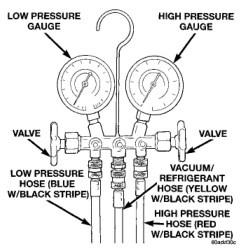

# DESCRIPTION AND OPERATION (Continued)

*Fig. 7 Manifold Gauge Set - Typical]*

### LOW PRESSURE GAUGE HOSE

The low pressure hose (Blue with Black stripe) attaches to the suction service port. This port is located on the suction line, near the accumulator outlet.

### HIGH PRESSURE GAUGE HOSE

The high pressure hose (Red with Black stripe) attaches to the discharge service port. This port is located on the liquid line between the condenser and the evaporator, near the front of the engine compartment.

### RECOVERY/RECYCLING/EVACUATION/CHARGING HOSE

The center manifold hose (Yellow, or White, with Black stripe) is used to recover, evacuate, and charge the refrigerant system. When the low or high pressure valves on the manifold gauge set are opened, the refrigerant in the system will escape through this hose.

## REFRIGERANT SYSTEM SERVICE PORT

The two refrigerant system service ports are used to charge, recover/recycle, evacuate, and test the air conditioning refrigerant system. Unique service port coupler sizes are used on the R-134a system, to ensure that the refrigerant system is not accidentally contaminated by the use of the wrong refrigerant (R-12), or refrigerant system service equipment.

The high pressure service port is located on the liquid line between the condenser and the evaporator, near the front of the engine compartment. The low pressure service port is located on the suction line, near the accumulator outlet.

Each of the service ports has a threaded plastic protective cap installed over it from the factory. After servicing the refrigerant system, always reinstall both of the service port caps.

## VACUUM CHECK VALVE

On models with a gasoline engine, a vacuum check valve is installed in the accessory vacuum supply line near the vacuum tap on the right side of the engine intake manifold. On models with a diesel engine, a vacuum check valve is installed on the engine vacuum pump. The vacuum check valve is designed to allow vacuum to flow in only one direction through the accessory vacuum supply circuits.

The use of a vacuum check valve helps to maintain the system vacuum needed to retain the selected heater-A/C mode and vehicle speed control settings. On gasoline engine models, it prevents the engine from bleeding down system vacuum through the intake manifold during extended heavy engine load (low engine vacuum) operation. On diesel engine models, it prevents oil from contaminating the vacuum supply system by maintaining vacuum in the pump after engine shut-off.

On gasoline engine models, a second vacuum check valve is installed in the accessory vacuum supply line at the tee fitting near the dash panel in the engine compartment. This check valve also helps to maintain the system vacuum needed to retain the selected heater-A/C mode settings, but isolates the heater-A/C vacuum circuit from the vehicle speed control vacuum circuit. It prevents the vehicle speed control servo from bleeding down the heater-A/C system vacuum during extended heavy engine load operation.

The vacuum check valve cannot be repaired and, if faulty or damaged, it must be replaced.

## VACUUM RESERVOIR

Models equipped with a gasoline engine have a vacuum reservoir. The vacuum reservoir is mounted in the passenger side cowl plenum area, under the cowl plenum cover/grille panel. The cowl plenum cover/grille panel must be removed from the vehicle to access the vacuum reservoir for service.

Engine vacuum is stored in the vacuum reservoir. The stored vacuum is used to operate the vacuum-controlled vehicle accessories during periods of low engine vacuum such as when the vehicle is climbing a steep grade, or under other high engine load operating conditions.

The vacuum reservoir cannot be repaired and, if faulty or damaged, it must be replaced.

*Source: 24 Heating and Air Conditioning, Page 10*
