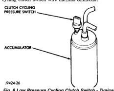

# DIAGNOSIS AND TESTING

## A/C PERFORMANCE

The air conditioning system is designed to provide the passenger compartment with low temperature and low humidity air. The evaporator, located in the heater-A/C housing on the dash panel below the instrument panel, is cooled to temperatures near the freezing point. As warm damp air passes through the cooled evaporator, the air transfers its heat to the refrigerant in the evaporator tubes and the moisture in the air condenses on the evaporator fins. During periods of high heat and humidity, an air conditioning system will be more effective in the recirculation mode (Max-A/C). With the system in the recirculation mode, only air from the passenger compartment passes through the evaporator. As the passenger compartment air dehumidifies, the air conditioning system performance levels improve.

Humidity has an important bearing on the temperature of the air delivered to the interior of the vehicle. It is important to understand the effect that humidity has on the performance of the air conditioning system. When humidity is high, the evaporator has to perform a double duty. It must lower the air temperature, and it must lower the temperature of the moisture in the air that condenses on the evaporator fins. Condensing the moisture in the air transfers heat energy into the evaporator fins and tubing. This reduces the amount of heat the evaporator can absorb from the air. High humidity greatly reduces the ability of the evaporator to lower the temperature of the air.

However, evaporator capacity used to reduce the amount of moisture in the air is not wasted. Wringing some of the moisture out of the air entering the vehicle adds to the comfort of the passengers. Although, an owner may expect too much from their air conditioning system on humid days. A performance test is the best way to determine whether the system is performing up to standard. This test also provides valuable clues as to the possible cause of trouble with the air conditioning system.

Review the Service Warnings and Precautions in the General Information section near the front of this group before performing this procedure. The air temperature in the test room and in the vehicle must be a minimum of 21° C (70° F) for this test.

(1) Connect a tachometer and a manifold gauge set.

(2) Set the heater-A/C mode control switch knob in the recirculation mode (Max-A/C) position, the temperature control knob in the full cool position, and the blower motor switch in the highest speed position.

(3) Start the engine and hold the idle speed at 1,000 rpm with the compressor clutch engaged. If the compressor clutch does not engage, see the A/C Diagnosis chart in the Diagnosis and Testing section of this group.

(4) The engine should be at operating temperature. The doors and windows must be open and the hood must be mostly closed.

(5) Insert a thermometer in the driver side center A/C (panel) outlet. Operate the engine for five minutes.

(6) The compressor clutch may cycle, depending upon the ambient temperature and humidity. If the clutch cycles, unplug the low pressure cycling clutch switch wire harness connector from the switch located on the accumulator (Fig. 8). Place a jumper wire between the two cavities of the low pressure cycling clutch switch wire harness connector.

*Fig. 8 Low Pressure Cycling Clutch Switch - Typical]*

(7) With the compressor clutch engaged, record the panel outlet discharge air temperature, the discharge pressure (high side), and the suction pressure (low side).

(8) Compare the panel outlet discharge air temperature reading to the Performance Temperature and Pressure chart. If the temperature reading is high, clamp off both heater hoses (inlet and outlet), wait five minutes and record the temperature again. Compare the second reading to the Performance Temperature and Pressure chart. If the temperature reading is now OK, see Temperature Control Cable in the Removal and Installation section and in the Adjustments section of this group. If the temperature reading is still too high, see Refrigerant System Leaks in the Diagnosis and Testing section of this group, and Refrigerant System Charge in the Service Procedures section of this group.

(9) Compare the discharge (high side) and suction (low side) pressure readings to the Performance Temperature and Pressure chart. If the pressures are abnormal, see the A/C Diagnosis chart in the Diagnosis and Testing section of this group.

*Source: 24 Heating and Air Conditioning, Page 11*
