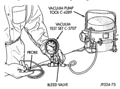

# DIAGNOSIS AND TESTING (Continued)

(8) If the vacuum tests, and the electrical component and circuit tests reveal no problems, disassemble the heater-A/C housing to inspect for mechanical misalignment or binding of the mode doors.

## VACUUM SYSTEM

Vacuum control is used to operate the mode doors in the heater-only and heater-A/C housings. Testing of the heater-only and heater-A/C mode control switch operation will determine if the vacuum, electrical, and mechanical controls are functioning. However, it is possible that a vacuum control system that operates perfectly at engine idle (high engine vacuum) may not function properly at high engine speeds or loads (low engine vacuum). This can be caused by leaks in the vacuum system, or by a faulty or improperly installed vacuum check valve.

A vacuum system test will help to identify the source of poor vacuum system performance or vacuum system leaks. Before starting this test, stop the engine and make certain that the problem is not a disconnected vacuum supply tube at the engine vacuum source or the vacuum reservoir.

Use an adjustable vacuum test set (Special Tool C-3707) and a suitable vacuum pump to test the heater-A/C vacuum control system. With a finger placed over the end of the vacuum test hose probe (Fig. 9), adjust the bleed valve on the test set gauge to obtain a vacuum of exactly 27 kPa (8 in. Hg.). Release and block the end of the probe several times to verify that the vacuum reading returns to the exact 27 kPa (8 in. Hg.) setting. Otherwise, a false reading will be obtained during testing.

*Fig. 9 Adjust Vacuum Test Bleed Valve]*

### VACUUM CHECK VALVE

(1) Remove the vacuum check valve. On gasoline engines, one valve is located in the vacuum supply tube (black) at the intake manifold tap on the right side of the engine. A second check valve is located next to the tee fitting in the vacuum supply tube (black) near the dash panel in the engine compartment. On diesel engines, the vacuum check valve is integral to the engine vacuum pump nipple and is threaded into the vacuum pump. The vacuum check valve must be removed in order to perform the following tests. See Vacuum Check Valve in the Removal and Installation section of this group for the procedures.

(2) Connect the test set vacuum supply hose to the heater-A/C control side of the valve. When connected to this side of the check valve, no vacuum should pass and the test set gauge should return to the 27 kPa (8 in. Hg.) setting. If OK, go to Step 3. If not OK, replace the faulty valve.

(3) Connect the test set vacuum supply hose to the engine vacuum side of the valve. When connected to this side of the check valve, vacuum should flow through the valve without restriction. If not OK, replace the faulty valve.

### HEATER-A/C CONTROLS

(1) Connect the test set vacuum probe to the heater-A/C vacuum supply (black) tube in the engine compartment. Position the test set gauge so that it can be viewed from the passenger compartment.

(2) Place the heater-A/C mode control switch knob in each mode position, one position at a time, and pause after each selection. The test set gauge should return to the 27 kPa (8 in. Hg.) setting shortly after each selection is made. If not OK, a component or vacuum line in the vacuum circuit of the selected mode has a leak. See Locating Vacuum Leaks in the Diagnosis and Testing section of this group.

**CAUTION: Do not use lubricant on the switch ports or in the holes in the plug, as lubricant will ruin the vacuum valve in the switch. A drop of clean water in the connector plug holes will help the connector slide onto the switch ports.**

*Source: 24 Heating and Air Conditioning, Page 16*
