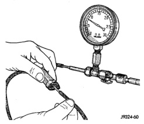

# HEATING AND AIR CONDITIONING 24 - 17

## DIAGNOSIS AND TESTING (Continued)

### LOCATING VACUUM LEAKS

**WARNING: ON VEHICLES EQUIPPED WITH AIRBAGS, REFER TO GROUP 8M - PASSIVE RESTRAINT SYSTEMS BEFORE ATTEMPTING ANY STEERING WHEEL, STEERING COLUMN, OR INSTRUMENT PANEL COMPONENT DIAGNOSIS OR SERVICE. FAILURE TO TAKE THE PROPER PRECAUTIONS COULD RESULT IN ACCIDENTAL AIRBAG DEPLOYMENT AND POSSIBLE PERSONAL INJURY.**

(1) Disconnect the vacuum harness connector located between the heater-A/C control and the heater-A/C housing under the instrument panel.

(2) Connect the test set vacuum hose probe to each port in the heater-A/C housing half of the vacuum harness connector, one port at a time, and pause after each connection (Fig. 10). The test set gauge should return to the 27 kPa (8 in. Hg.) setting shortly after each connection is made. If OK, replace the faulty heater-A/C control. If not OK, go to Step 3.

*Fig. 10 Vacuum Circuit Test]*

(3) Determine the vacuum line color of the vacuum circuit that is leaking. To determine the vacuum line colors, see the Vacuum Circuits chart (Fig. 11).

(4) Disconnect and plug the vacuum line from the component (fitting, actuator, valve, switch, or reservoir) on the other end of the leaking circuit. Instrument panel disassembly or removal may be necessary to gain access to some components. See the Removal and Installation section of this group for more information.

(5) Connect the test set hose or probe to the open end of the leaking circuit. The test set gauge should return to the 27 kPa (8 in. Hg.) setting shortly after each connection is made. If OK, replace the faulty disconnected component. If not OK, go to Step 6.

(6) To locate a leak in a vacuum line, leave one end of the line plugged and connect the test set hose or probe to the other end of the line. Run your fingers slowly along the line while watching the test set gauge. The vacuum reading will fluctuate when your fingers contact the source of the leak. To repair the vacuum line, cut out the leaking section of the line. Then, insert the loose ends of the line into a suitable length of 3 millimeter (0.125 inch) inside diameter rubber hose.

### BLOWER MOTOR

**WARNING: ON VEHICLES EQUIPPED WITH AIRBAGS, REFER TO GROUP 8M - PASSIVE RESTRAINT SYSTEMS BEFORE ATTEMPTING ANY STEERING WHEEL, STEERING COLUMN, OR INSTRUMENT PANEL COMPONENT DIAGNOSIS OR SERVICE. FAILURE TO TAKE THE PROPER PRECAUTIONS COULD RESULT IN ACCIDENTAL AIRBAG DEPLOYMENT AND POSSIBLE PERSONAL INJURY.**

For circuit descriptions and diagrams, refer to 8W-42 - Air Conditioning/Heater in Group 8W - Wiring Diagrams. Possible causes of an inoperative blower motor include:

- Faulty fuse
- Faulty blower motor circuit wiring or wire harness connectors
- Faulty blower motor resistor
- Faulty blower motor relay
- Faulty blower motor switch
- Faulty heater-A/C mode control switch
- Faulty blower motor.

Possible causes of the blower motor not operating in all speeds include:

- Faulty fuse
- Faulty blower motor switch
- Faulty blower motor resistor
- Faulty blower motor relay
- Faulty blower motor circuit wiring or wire harness connectors.

### VIBRATION

Possible causes of blower motor vibration include:

- Improper blower motor mounting
- Improper blower wheel mounting
- Blower wheel out of balance or deformed
- Blower motor faulty.

### NOISE

To verify that the blower is the source of the noise, unplug the blower motor wire harness connector and

*Source: 24 Heating and Air Conditioning, Page 17*
