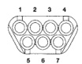

# 24 - 18 HEATING AND AIR CONDITIONING

## DIAGNOSIS AND TESTING (Continued)

### VACUUM CIRCUIT LEGEND

| ID | FUNCTION | COLOR |
|----|----------|-------|
| 1 | RECIRCULATION ACTUATOR | GREEN |
| 2 | DEFROST/FLOOR ACTUATOR | RED |
| 3 | VACUUM RESERVOIR | BLACK |
| 4 | NOT USED | N/A |
| 5 | DEFROST/FLOOR ACTUATOR | BROWN |
| 6 | PANEL/DEFROST ACTUATOR | YELLOW |
| 7 | NOT USED | N/A |

*Fig. 11 Heater-A/C Vacuum Harness Connector - Housing Half (Viewed From Engagement End)*

### HEATER ONLY

| MODE KNOB POSITION | DK GRN | RED | BLK | LT BLU | BRN | YEL | LT GRN |
|--------------------|--------|-----|-----|--------|-----|-----|--------|
| | 1 | 2 | 3 | 4 | 5 | 6 | 7 |
| OFF | - | O | - | N | O | - | N |
| | | O | | O | | | T |
| BI-LEVEL | O | - | - | / | O | - | / |
| PANEL | O | O | - | U | O | - | U |
| FLOOR | O | - | - | S | - | O | S |
| FLOOR/DEFROST | O | - | - | E | O | O | E |
| DEFROST | O | O | O | D | O | O | D |

- = VACUUM
O = VENTED

### HEATER - A/C

| MODE KNOB POSITION | DK GRN | RED | BLK | LT BLU | BRN | YEL | LT GRN | |
|--------------------|--------|-----|-----|--------|-----|-----|--------|---|
| | 1 | 2 | 3 | 4 | 5 | 6 | 7 | |
| OFF | - | O | - | N | O | - | N | OFF |
| MAX A/C | O | - | O | O | O | - | O | ON |
| PANEL A/C | O | O | - | T | O | - | T | ON |
| BI-LEVEL A/C | O | - | - | / | O | - | / | ON |
| PANEL | O | O | - | U | O | - | U | OFF |
| FLOOR | O | - | - | S | - | O | S | OFF |
| FLOOR/DEFROST | O | - | - | E | O | O | E | ON |
| DEFROST | O | O | - | D | O | O | D | ON |

[Figure: Fig. 11 Vacuum Circuits]

*Source: 24 Heating and Air Conditioning, Page 18*
