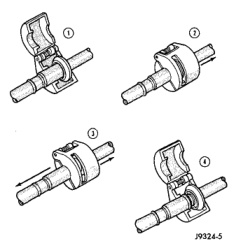
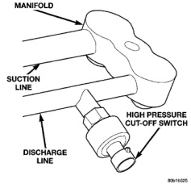

# HEATING AND AIR CONDITIONING 24 - 25

## REMOVAL AND INSTALLATION (Continued)

*Fig. 14 Refrigerant Line Spring-Lock Coupler Disconnect]*

(6) Open and remove the A/C line disconnect tool from the disconnected spring-lock coupler.

(7) Complete the separation of the two halves of the coupler fitting.

#### INSTALLATION

(1) Check to ensure that the garter spring is located within the cage of the male coupler fitting, and that the garter spring is not damaged.

(a) If the garter spring is missing, install a new spring by pushing it into the coupler cage opening.

(b) If the garter spring is damaged, remove it from the coupler cage with a small wire hook (DO NOT use a screwdriver) and install a new garter spring.

(2) Clean any dirt or foreign material from both halves of the coupler fitting.

(3) Install new O-rings on the male half of the coupler fitting.

**CAUTION: Use only the specified O-rings as they are made of a special material for the R-134a system. The use of any other O-rings may allow the connection to leak intermittently during vehicle operation.**

(4) Lubricate the male fitting and O-rings, and the inside of the female fitting with clean R-134a refrigerant oil. Use only refrigerant oil of the type recommended for the compressor in the vehicle.

(5) Fit the female half of the coupler fitting over the male half of the fitting.

(6) Push together firmly on the two halves of the coupler fitting until the garter spring in the cage on the male half of the fitting snaps over the flanged end on the female half of the fitting.

(7) Ensure that the spring-lock coupler is fully engaged by trying to separate the two coupler halves. This is done by pulling the refrigerant lines on either side of the coupler away from each other.

(8) Reinstall the secondary clip over the spring-lock coupler cage.

### HIGH PRESSURE CUT-OFF SWITCH

#### REMOVAL

(1) Disconnect and isolate the battery negative cable.

(2) Unplug the wire harness connector from the high pressure cut-off switch, which is mounted to a fitting on the discharge line between the compressor and the condenser inlet (Fig. 15).

*Fig. 15 High Pressure Cut-Off Switch Remove/Install]*

(3) Unscrew the high pressure cut-off switch from the discharge line fitting.

(4) Remove the high pressure cut-off switch from the vehicle.

(5) Remove the O-ring seal from the discharge line fitting and discard.

#### INSTALLATION

(1) Lubricate a new O-ring seal with clean refrigerant oil and install it on the discharge line fitting. Use only the specified O-rings as they are made of a special material for the R-134a system. Use only

*Source: 24 Heating and Air Conditioning, Page 25*
