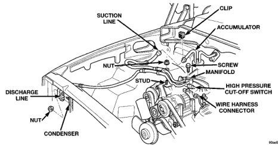

# 24 - 26 HEATING AND AIR CONDITIONING

## REMOVAL AND INSTALLATION (Continued)

refrigerant oil of the type recommended for the compressor in the vehicle.

(2) Install and tighten the high pressure cut-off switch on the discharge line fitting.

(3) Plug the wire harness connector into the high pressure cut-off switch.

(4) Connect the battery negative cable.

### SUCTION AND DISCHARGE LINE

Any kinks or sharp bends in the refrigerant plumbing will reduce the capacity of the entire air conditioning system. Kinks and sharp bends reduce the flow of refrigerant in the system. A good rule for the flexible hose refrigerant lines is to keep the radius of all bends at least ten times the diameter of the hose. In addition, the flexible hose refrigerant lines should be routed so they are at least 80 millimeters (3 inches) from the exhaust manifold.

High pressures are produced in the refrigerant system when the air conditioning compressor is operating. Extreme care must be exercised to make sure that each of the refrigerant system connections is pressure-tight and leak free. It is a good practice to inspect all flexible hose refrigerant lines at least once a year to make sure they are in good condition and properly routed.

**WARNING: REVIEW THE WARNINGS AND CAUTIONS IN THE GENERAL INFORMATION SECTION NEAR THE FRONT OF THIS GROUP BEFORE PERFORMING THE FOLLOWING OPERATION.**

#### REMOVAL

(1) Disconnect and isolate the battery negative cable.

(2) Recover the refrigerant from the refrigerant system. See Refrigerant Recovery in the Service Procedures section of this group.

(3) Unplug the wire harness connector from the high pressure cut-off switch.

(4) Disconnect the suction line refrigerant line coupler at the accumulator. See Refrigerant Line Coupler in the Removal and Installation section of this group for the procedures. Install plugs in, or tape over all of the opened refrigerant line fittings.

(5) Remove the nut that secures the block fitting to the stud on the condenser inlet and disconnect the discharge line from the condenser. Install plugs in, or tape over all of the opened refrigerant line fittings.

(6) On models with a gasoline engine, remove the nut that secures the refrigerant line support bracket to the stud on the compressor mounting bracket.

(7) Remove the screw that secures the refrigerant line manifold to the compressor (Fig. 16) or (Fig. 17). Install plugs in, or tape over all of the opened refrigerant line fittings.

(8) Remove the suction and discharge line assembly from the vehicle.

#### INSTALLATION

(1) Remove the tape or plugs from all of the refrigerant line fittings. Connect the suction line refrigerant line coupler to the accumulator. See Refrigerant Line Coupler in the Removal and Installation section of this group for the procedures.

*Fig. 16 Suction and Discharge Line Remove/Install - Gasoline Engine]*

*Source: 24 Heating and Air Conditioning, Page 26*
