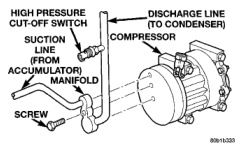
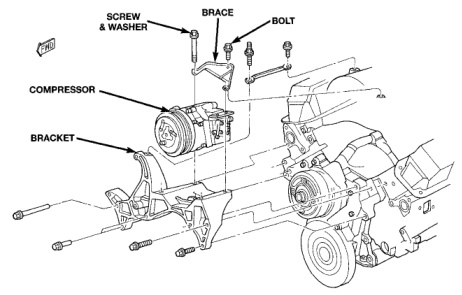

# HEATING AND AIR CONDITIONING 24 - 27

## REMOVAL AND INSTALLATION (Continued)

*Fig. 17 Suction and Discharge Line Remove/Install - Diesel Engine]*

(2) Install a new gasket and the discharge line block fitting over the stud on the condenser inlet. Tighten the mounting nut to 20 N-m (180 in. lbs.).

(3) Install the refrigerant line manifold to the compressor. Tighten the mounting screw to 22 N-m (200 in. lbs.).

(4) On models with a gasoline engine, install the nut that secures the refrigerant line support bracket to the stud on the compressor mounting bracket. Tighten the mounting nut to 22 N-m (200 in. lbs.).

(5) Plug in the wire harness connector to the high pressure cut-off switch.

(6) Connect the battery negative cable.

(7) Evacuate the refrigerant system. See Refrigerant System Evacuate in the Service Procedures section of this group.

(8) Charge the refrigerant system. See Refrigerant System Charge in the Service Procedures section of this group.

### COMPRESSOR

The compressor may be removed and repositioned without disconnecting the refrigerant lines or discharging the refrigerant system. Discharging is not necessary if servicing the compressor clutch or clutch coil, the engine, the cylinder head, or the generator.

**WARNING: REVIEW THE WARNINGS AND CAUTIONS IN THE GENERAL INFORMATION SECTION NEAR THE FRONT OF THIS GROUP BEFORE PERFORMING THE FOLLOWING OPERATION.**

#### REMOVAL

(1) Recover the refrigerant from the refrigerant system. See Refrigerant Recovery in the Service Procedures section of this group.

(2) Disconnect and isolate the battery negative cable.

*Fig. 18 Compressor Remove/Install - Gasoline Engine]*

*Source: 24 Heating and Air Conditioning, Page 27*
