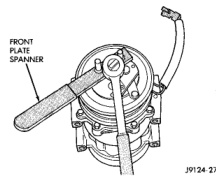
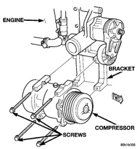

# 24 - 28 HEATING AND AIR CONDITIONING

## REMOVAL AND INSTALLATION (Continued)

(3) Remove the serpentine drive belt. Refer to Group 7 - Cooling System for the procedures.

(4) Unplug the compressor clutch coil wire harness connector.

(5) Remove the suction and discharge refrigerant line manifold from the compressor. See Suction and Discharge Line in the Removal and Installation section of this group for the procedures. Install plugs in, or tape over all of the opened refrigerant line fittings.

(6) Remove the four screws that secure the compressor to the mounting bracket (Fig. 18) or (Fig. 19).

*Fig. 19 Compressor Remove/Install - Diesel Engine]*

(7) Remove the compressor from the mounting bracket.

**NOTE: If a replacement compressor is being installed, be certain to check the refrigerant oil level. See Refrigerant Oil Level in the Service Procedures section of this group. Use only refrigerant oil of the type recommended for the compressor in the vehicle.**

#### INSTALLATION

(1) Install the compressor to the mounting bracket. Tighten the four mounting screws to 24 N-m (210 in. lbs.).

(2) Remove the tape or plugs from all of the opened refrigerant line fittings. Install the suction and discharge line manifold to the compressor. See Suction and Discharge Line in the Removal and Installation section of this group for the procedures.

(3) Install the serpentine drive belt. Refer to Group 7 - Cooling System for the procedures.

(4) Plug in the compressor clutch coil wire harness connector.

(5) Connect the battery negative cable.

(6) Evacuate the refrigerant system. See Refrigerant System Evacuate in the Service Procedures section of this group.

(7) Charge the refrigerant system. See Refrigerant System Charge in the Service Procedures section of this group.

### COMPRESSOR CLUTCH

The refrigerant system can remain fully-charged during compressor clutch, pulley, or coil replacement. The compressor clutch can be serviced in the vehicle.

#### REMOVAL

(1) Disconnect and isolate the battery negative cable.

(2) On models with the diesel engine option, remove the compressor from the engine. Do not remove the refrigerant lines or fittings. See Compressor in the Removal and Installation section of this group for the procedures.

(3) Unplug the compressor clutch coil wire harness connector.

(4) Insert the two pins of the spanner wrench (Special Tool 6462 in Kit 6460) into the holes of the clutch plate. Hold the clutch plate stationary and remove the hex nut (Fig. 20).

*Fig. 18 Clutch Nut Remove]*

*Source: 24 Heating and Air Conditioning, Page 28*
