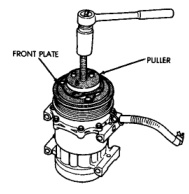
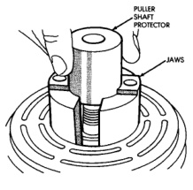
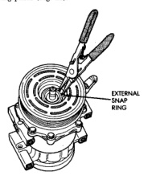
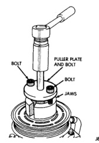

# HEATING AND AIR CONDITIONING 24 - 29

## REMOVAL AND INSTALLATION (Continued)

(5) Remove the clutch plate and clutch shims. On models with the diesel engine option, a puller (Special Tool 6461 in Kit 6460) is used to remove the clutch plate (Fig. 21). This compressor also uses a shaft key, which must be removed.

*Fig. 21 Clutch Puller - Diesel Models]*

(6) Remove the external front housing snap ring with snap ring pliers (Fig. 22).

*Fig. 22 External Snap Ring Remove]*

(7) Install the lip of the rotor puller (Special Tool C-6141-1 in Kit 6460) into the snap ring groove exposed in Step 6, and install the shaft protector (Special Tool C-6141-2 in Kit 6460) (Fig. 23).

*Fig. 23 Shaft Protector and Puller]*

(8) Install the puller through-bolts (Special Tool C-6461) through the puller flange and into the jaws of the rotor puller and tighten (Fig. 24). Turn the puller center bolt clockwise until the rotor pulley is free.

*Fig. 24 Install Puller Plate]*

(9) Remove the screw and retainer from the clutch coil lead wire harness on the compressor front housing (Fig. 25).

*Source: 24 Heating and Air Conditioning, Page 29*
