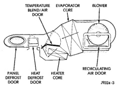
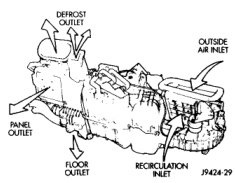

# GENERAL INFORMATION

## HEATER AND AIR CONDITIONER

All vehicles are equipped with a common heater-A/C housing assembly (Fig. 1). The system combines air conditioning, heating, and ventilating capabilities in a single unit housing mounted under the instrument panel. On heater-only systems, the evaporator coil is omitted from the housing and replaced with an air restrictor plate.

*Fig. 1 Common Blend-Air Heater-Air Conditioner System]*

Outside fresh air enters the vehicle through the cowl top opening at the base of the windshield, and passes through a plenum chamber to the heater-A/C system blower housing (Fig. 2). Air flow velocity can then be adjusted with the blower motor speed selector switch on the heater-A/C control panel. The air intake openings must be kept free of snow, ice, leaves, and other obstructions for the heater-A/C system to receive a sufficient volume of outside air.

*Fig. 2 Heater-A/C System Air Flow (Front View)]*

It is also important to keep the air intake openings clear of debris because leaf particles and other debris that is small enough to pass through the cowl plenum screen can accumulate within the heater-A/C housing. The closed, warm, damp and dark environment created within the heater-A/C housing is ideal for the growth of certain molds, mildews and other fungi. Any accumulation of decaying plant matter provides an additional food source for fungal spores, which enter the housing with the fresh air. Excess debris, as well as objectionable odors created by decaying plant matter and growing fungi can be discharged into the passenger compartment during heater-A/C system operation.

The heater and optional air conditioner are blend-air type systems. In a blend-air system, a blend-air door controls the amount of unconditioned air (or cooled air from the evaporator on models with air conditioning) that is allowed to flow through, or around, the heater core. A temperature control knob on the heater-A/C control panel determines the discharge air temperature by moving a cable, which operates the blend-air door. This allows an almost immediate manual control of the output air temperature of the system.

The mode control knob on the heater-only or heater-A/C control panel is used to direct the conditioned air to the selected system outlets. Both mode control switches use engine vacuum to control the mode doors, which are operated by vacuum actuator motors.

On air conditioned vehicles, the outside air intake can be shut off by selecting the recirculation mode (Max A/C) with the mode control knob. This will operate a vacuum actuated recirculating air door that closes off the outside fresh air intake and recirculates the air that is already inside the vehicle.

The optional air conditioner for all models is designed for the use of non-CFC, R-134a refrigerant. The air conditioning system has an evaporator to cool and dehumidify the incoming air prior to blending it with the heated air. This air conditioning system uses a fixed orifice tube in the liquid line between the condenser and the evaporator coil to meter refrigerant flow to the evaporator coil. To maintain minimum evaporator temperature and prevent evaporator freezing, a fixed pressure setting switch on the accumulator cycles the compressor clutch.

## HEATER AND AIR CONDITIONER CONTROL

Both the heater-only and heater-A/C systems use a combination of mechanical, electrical, and vacuum controls. These controls provide the vehicle operator with a number of setting options to help control the climate and comfort within the vehicle. Refer to the owner's manual in the vehicle glove box for more

*Source: 24 Heating and Air Conditioning, Page 2*
