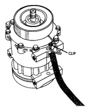
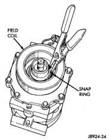
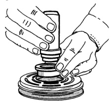

# 24 - 30 HEATING AND AIR CONDITIONING

## REMOVAL AND INSTALLATION (Continued)

*Fig. 25 Clutch Coil Lead Wire Harness]*

(10) Remove the snap ring from the compressor hub and remove the clutch field coil (Fig. 26). Slide the clutch field coil off of the compressor hub.

*Fig. 26 Clutch Field Coil Snap Ring Remove]*

### INSPECTION

Examine the friction surfaces of the clutch pulley and the front plate for wear. The pulley and front plate should be replaced if there is excessive wear or scoring.

If the friction surfaces are oily, inspect the shaft and nose area of the compressor for oil. Remove the felt from the front cover. If the felt is saturated with oil, the shaft seal is leaking and the compressor must be replaced.

Check the clutch pulley bearing for roughness or excessive leakage of grease. Replace the bearing, if required.

### INSTALLATION

(1) Install the clutch field coil and snap ring.

(2) Install the clutch coil lead wire harness retaining clip on the compressor front housing and tighten the retaining screw.

(3) Align the rotor assembly squarely on the front compressor housing hub.

(4) Thread the handle (Special Tool 6464 in Kit 6460) into the driver (Special Tool 6143 in Kit 6460) (Fig. 27).

*Fig. 27 Rotor Installer Set]*

(5) Place the driver tool assembly into the bearing cavity on the rotor. Make certain the outer edge of the tool rests firmly on the rotor bearing inner race (Fig. 28).

(6) Tap the end of the driver while guiding the rotor to prevent binding. Tap until the rotor bottoms against the compressor front housing hub. Listen for a distinct change of sound during the tapping process, to indicate the bottoming of the rotor.

(7) Install the external front rotor snap ring with snap ring pliers. The bevel side of the snap ring must be facing outward. Press the snap ring to make sure it is properly seated in the groove.

*Source: 24 Heating and Air Conditioning, Page 30*
