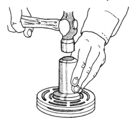
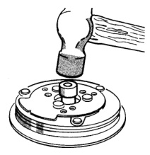
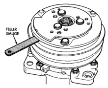

# HEATING AND AIR CONDITIONING 24 - 31

## REMOVAL AND INSTALLATION (Continued)

*Fig. 28 Rotor Install]*

**CAUTION: If the snap ring is not fully seated in the groove it will vibrate out, resulting in a clutch failure and severe damage to the front housing of the compressor.**

(8) Install the original clutch shims on the compressor shaft.

(9) Install the clutch plate. On models with the diesel engine option, install the shaft key. Use the shaft protector (Special Tool 6141-2 in Kit 6460) to install the clutch plate on the compressor shaft (Fig. 29). Tap the clutch plate over the compressor shaft until it has bottomed against the clutch shims. Listen for a distinct change of sound during the tapping process, to indicate the bottoming of the clutch plate.

(10) Replace the compressor shaft hex nut. Tighten the nut to 14.4 N-m (10.5 ft. lbs.).

(11) Check the clutch air gap with a feeler gauge (Fig. 30). If the air gap does not meet the specification, add or subtract shims as required. The air gap specification is 0.41 to 0.79 millimeter (0.016 to 0.031 inch). If the air gap is not consistent around the circumference of the clutch, lightly pry up at the minimum variations. Lightly tap down at the points of maximum variation.

**NOTE: The air gap is determined by the spacer shims. When installing an original, or a new clutch assembly, try the original shims first. When installing a new clutch onto a compressor that previously did not have a clutch, use 1.0, 0.50, and 0.13 millimeter (0.040, 0.020, and 0.005 inch) shims from the clutch hardware package that is provided with the new clutch.**

*Fig. 29 Clutch Plate Install]*

*Fig. 30 Check Clutch Air Gap]*

(12) Reverse the remaining removal procedures to complete the installation.

### CLUTCH BREAK-IN

After a new compressor clutch has been installed, cycle the compressor clutch approximately twenty times (five seconds on, then five seconds off). During this procedure, set the heater-A/C control to the recirculation mode (Max-A/C), the blower motor switch in the highest speed position, and the engine speed at 1500 to 2000 rpm. This procedure (burnishing) will seat the opposing friction surfaces and provide a higher compressor clutch torque capability.

*Source: 24 Heating and Air Conditioning, Page 31*
