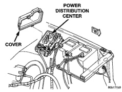
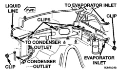

# 24 - 32 HEATING AND AIR CONDITIONING

## REMOVAL AND INSTALLATION (Continued)

### COMPRESSOR CLUTCH RELAY

(1) Disconnect and isolate the battery negative cable.

(2) Remove the cover from the Power Distribution Center (PDC) (Fig. 31).

*Fig. 31 Power Distribution Center]*

(3) Refer to the label on the PDC for compressor clutch relay identification and location.

(4) Unplug the compressor clutch relay from the PDC.

(5) Install the compressor clutch relay by aligning the relay terminals with the cavities in the PDC and pushing the relay firmly into place.

(6) Install the PDC cover.

(7) Connect the battery negative cable.

(8) Test the relay operation.

### LIQUID LINE

Any kinks or sharp bends in the refrigerant plumbing will reduce the capacity of the entire air conditioning system. Kinks and sharp bends reduce the flow of refrigerant in the system. High pressures are produced in the refrigerant system when the air conditioning compressor is operating. Extreme care must be exercised to make sure that each of the refrigerant system connections is pressure-tight and leak free.

**WARNING: REVIEW THE WARNINGS AND CAUTIONS IN THE GENERAL INFORMATION SECTION NEAR THE FRONT OF THIS GROUP BEFORE PERFORMING THE FOLLOWING OPERATION.**

#### REMOVAL

(1) Disconnect and isolate the battery negative cable.

(2) Recover the refrigerant from the refrigerant system. See Refrigerant Recovery in the Service Procedures section of this group.

(3) Disconnect the liquid line refrigerant line couplers at the condenser outlet and the evaporator inlet. See Refrigerant Line Coupler in the Removal and Installation section of this group for the procedures. Install plugs in, or tape over all of the opened refrigerant line fittings.

(4) Disengage any clips that secure the liquid line to the inner fender shield and the dash panel (Fig. 32).

*Fig. 32 Liquid Line Remove/Install]*

(5) Remove the liquid line from the vehicle.

#### INSTALLATION

(1) Install the liquid line into any clips on the inner fender shield and the dash panel.

(2) Remove the tape or plugs from the refrigerant line fittings on the liquid line, the condenser outlet, and the evaporator inlet. Connect the liquid line to the condenser and the evaporator. See Refrigerant Line Coupler in the Removal and Installation section of this group for the procedures.

(3) Connect the battery negative cable.

(4) Evacuate the refrigerant system. See Refrigerant System Evacuate in the Service Procedures section of this group.

(5) Charge the refrigerant system. See Refrigerant System Charge in the Service Procedures section of this group.

### FIXED ORIFICE TUBE

The fixed orifice tube is located in the liquid line, between the condenser and the evaporator coil. The orifice has filter screens on the inlet and outlet ends of the tube body. If the fixed orifice tube is faulty or plugged, the liquid line assembly must be replaced. See Liquid Line in the Removal and Installation section of this group for the service procedures.

### LOW PRESSURE CYCLING CLUTCH SWITCH

#### REMOVAL

(1) Disconnect and isolate the battery negative cable.

*Source: 24 Heating and Air Conditioning, Page 32*
