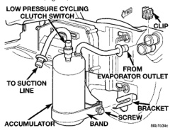
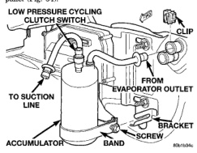

# REMOVAL AND INSTALLATION (Continued)

(2) Unplug the wire harness connector from the low pressure cycling clutch switch on the top of the accumulator (Fig. 33).

*Fig. 33 Low Pressure Cycling Clutch Switch Remove/Install - Shows accumulator with low pressure cycling clutch switch, clip, bracket screw, band, and connection from evaporator outlet to suct*

(3) Unscrew the low pressure cycling clutch switch from the fitting on the top of the accumulator.

(4) Remove the O-ring seal from the accumulator fitting and discard.

## INSTALLATION

(1) Lubricate a new O-ring seal with clean refrigerant oil and install it on the accumulator fitting. Use only the specified O-rings as they are made of a special material for the R-134a system. Use only refrigerant oil of the type recommended for the compressor in the vehicle.

(2) Install and tighten the low pressure cycling clutch switch on the accumulator fitting. The switch should be hand-tightened onto the accumulator fitting.

(3) Plug the wire harness connector into the low pressure cycling clutch switch.

(4) Connect the battery negative cable.

## ACCUMULATOR

**WARNING: REVIEW THE WARNINGS AND CAUTIONS IN THE GENERAL INFORMATION SECTION NEAR THE FRONT OF THIS GROUP BEFORE PERFORMING THE FOLLOWING OPERATION.**

## REMOVAL

(1) Disconnect and isolate the battery negative cable.

(2) Recover the refrigerant from the refrigerant system. See Refrigerant Recovery in the Service Procedures section of this group.

(3) Remove the low pressure cycling clutch switch from the accumulator. See Low Pressure Cycling Clutch Switch in the Removal and Installation section of this group for the procedures.

(4) Loosen the screw that secures the accumulator retaining band to the support bracket on the dash panel (Fig. 34).

*Fig. 34 Accumulator Remove/Install - Shows low pressure cycling clutch switch, clip, accumulator, band, bracket screw, and connection from evaporator outlet to suction line]*

(5) Disconnect the suction line refrigerant line fitting from the accumulator outlet. See Refrigerant Line Coupler in the Removal and Installation section of this group for the procedures. Install plugs in, or tape over all of the opened refrigerant line fittings.

(6) Disconnect the accumulator inlet refrigerant line fitting from the evaporator outlet. See Refrigerant Line Coupler in the Removal and Installation section of this group for the procedures. Install plugs in, or tape over all of the opened refrigerant line fittings.

(7) Pull the accumulator and retaining band unit forward until the screw in the band is clear of the slotted hole in the support bracket on the dash panel.

(8) Remove the accumulator from the engine compartment.

## INSTALLATION

(1) Install the accumulator and retaining band as a unit by sliding the screw in the band into the slotted hole in the support bracket on the dash panel.

(2) Remove the tape or plugs from the refrigerant line fittings on the accumulator inlet and the evaporator outlet. Connect the accumulator inlet refrigerant line coupler to the evaporator outlet. See Refrigerant Line Coupler in the Removal and Installation section of this group for the procedures.

(3) Tighten the accumulator retaining band screw to 4.5 N·m (40 in. lbs.).

(4) Remove the tape or plugs from the refrigerant line fittings on the suction line and the accumulator

*Source: 24 Heating and Air Conditioning, Page 33*
