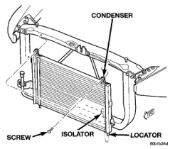
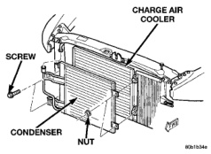

# REMOVAL AND INSTALLATION (Continued)

outlet. Connect the suction line refrigerant line coupler to the accumulator outlet. See Refrigerant Line Coupler in the Removal and Installation section of this group for the procedures.

(5) Reinstall the low pressure cycling clutch switch on the accumulator. See Low Pressure Cycling Clutch Switch in the Removal and Installation section of this group for the procedures.

(6) Connect the battery negative cable.

(7) Evacuate the refrigerant system. See Refrigerant System Evacuate in the Service Procedures section of this group.

(8) Charge the refrigerant system. See Refrigerant System Charge in the Service Procedures section of this group.

**NOTE: If the accumulator is replaced, add 60 milliliters (2 fluid ounces) of refrigerant oil to the refrigerant system. Use only refrigerant oil of the type recommended for the compressor in the vehicle.**

## CONDENSER

**WARNING: REVIEW THE WARNINGS AND CAUTIONS IN THE GENERAL INFORMATION SECTION NEAR THE FRONT OF THIS GROUP BEFORE PERFORMING THE FOLLOWING OPERATION.**

**CAUTION: Before removing the condenser, note the location of each of the radiator and condenser air seals. These seals are used to direct air through the condenser and radiator. The air seals must be reinstalled in their proper locations in order for the air conditioning and engine cooling systems to perform as designed.**

## REMOVAL

(1) Disconnect and isolate the battery negative cable.

(2) Recover the refrigerant from the refrigerant system. See Refrigerant Recovery in the Service Procedures section of this group.

(3) Remove the nut that secures the block fitting to the stud on the condenser inlet and disconnect the discharge line from the condenser. Install plugs in, or tape over all of the opened refrigerant line fittings.

(4) Disconnect the refrigerant line fitting that secures the liquid line to the condenser outlet. See Refrigerant Line Coupler in the Removal and Installation section of this group for the procedures. Install plugs in, or tape over all of the opened refrigerant line fittings.

(5) On gasoline engine models:

(a) Remove the two screws that secure the condenser upper mounting brackets to the outside of the upper radiator crossmember (Fig. 35).

(b) Tilt the condenser away from the engine compartment far enough to grasp the top of the condenser with both hands.

(c) Lift the condenser far enough to remove the two lower condenser locators from the isolators in the holes of the lower crossmember.

(d) Remove the condenser from the vehicle.

*Fig. 35 Condenser Remove/Install - Gasoline Engine - Shows condenser with screw, isolator, and locator labeled]*

(6) On diesel engine models:

(a) Remove the two screws that secure the brackets on the passenger side end of the condenser to the charge air cooler (Fig. 36).

(b) Remove the two nuts that secure the driver side end of the condenser to the studs on the charge air cooler.

(c) Remove the condenser from the vehicle.

*Fig. 36 Condenser Remove/Install - Diesel Engine - Shows condenser with charge air cooler, screw, and nut labeled]*

*Source: 24 Heating and Air Conditioning, Page 34*
