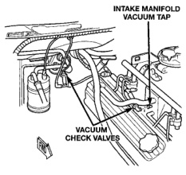
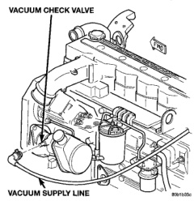

# REMOVAL AND INSTALLATION (Continued)

## INSTALLATION

(1) On gasoline engine models:

(a) Insert the two lower condenser locators into the isolators in the holes of the lower crossmember.

(b) Tilt the condenser up towards the engine compartment far enough to align the upper mounting bracket holes with the holes in the upper radiator crossmember.

(c) Install the two screws that secure the condenser upper mounting brackets to the outside of the upper radiator crossmember. Tighten the mounting screws to 10.5 N·m (95 in. lbs.).

(2) On diesel engine models:

(a) Install the driver side condenser mounting brackets over the two studs on the charge air cooler.

(b) Install the two screws that secure the brackets on the passenger side end of the condenser to the charge air cooler. Tighten the mounting screws to 10.5 N·m (95 in. lbs.).

(c) Install the two nuts that secure the driver side end of the condenser to the studs on the charge air cooler. Tighten the mounting nuts to 10.5 N·m (95 in. lbs.).

(3) Remove the plugs or tape from the refrigerant line fittings on the liquid line and the condenser outlet. Connect the liquid line to the condenser outlet. See Refrigerant Line Coupler in the Removal and Installation section of this group for the procedures.

(4) Install a new gasket and the discharge line block fitting over the stud on the condenser inlet. Tighten the mounting nut to 20 N·m (180 in. lbs.).

(5) Check that all of the condenser and radiator air seals are in their proper locations.

(6) Connect the battery negative cable.

(7) Evacuate the refrigerant system. See Refrigerant System Evacuate in the Service Procedures section of this group.

(8) Charge the refrigerant system. See Refrigerant System Charge in the Service Procedures section of this group.

**NOTE: If the condenser is replaced, add 30 milliliters (1 fluid ounce) of refrigerant oil to the refrigerant system. Use only refrigerant oil of the type recommended for the compressor in the vehicle.**

## VACUUM CHECK VALVE

(1) On models with a gasoline engine, unplug the vacuum supply line connector at the vacuum check valve (Fig. 37). On models with a diesel engine, remove the clamp from the vacuum supply line connector and unplug the connector from the vacuum check valve (Fig. 38).

*Fig. 37 Vacuum Check Valves - Gasoline Engine - Shows intake manifold vacuum tap and vacuum check valves]*

*Fig. 38 Vacuum Check Valve - Diesel Engine - Shows vacuum check valve and vacuum supply line]*

(2) On models with a gasoline engine, note the orientation of the check valve in the vacuum supply line for correct reinstallation.

(3) On models with a gasoline engine, unplug the vacuum check valve from the vacuum supply line fitting. On models with a diesel engine, unscrew the check valve and nipple unit from the engine vacuum pump.

*Source: 24 Heating and Air Conditioning, Page 35*
