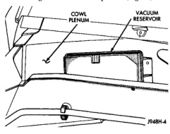
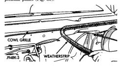
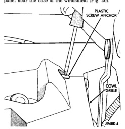

# REMOVAL AND INSTALLATION (Continued)

(4) Reverse the removal procedures to install. On models with a diesel engine, tighten the check valve and nipple unit to 24 N·m (18 ft. lbs.).

## VACUUM RESERVOIR

(1) Disconnect and isolate the battery negative cable.

(2) Remove the wiper arms from the wiper pivots. Refer to Wiper Arm in the Removal and Installation section of Group 8K - Wiper and Washer Systems for the procedures.

(3) Remove the weatherstrip along the front edge of the cowl plenum cover/grille panel and the cowl plenum panel (Fig. 39).

*Fig. 39 Cowl Plenum Cover/Grille Panel Weatherstrip - Shows cowl grille and weatherstrip]*

(4) Remove the plastic screws that secure the cowl plenum cover/grille panel to the studs on the cowl top panel near the base of the windshield (Fig. 40).

*Fig. 40 Cowl Plenum Plastic Screws Remove/Install - Shows plastic screw anchor and cowl grille]*

(5) Lift the cowl plenum cover/grille panel from the cowl top far enough to access the vacuum reservoir near the right end of the cowl plenum.

(6) Disconnect the vacuum supply hose from the vacuum reservoir, which is secured to the dash panel near the right end of the cowl plenum (Fig. 41).

*Fig. 41 Vacuum Reservoir - Shows cowl plenum and vacuum reservoir]*

(7) Remove the two nuts that secure the reservoir to the studs on the dash panel near the right end of the cowl plenum.

(8) Remove the vacuum reservoir from the dash panel studs.

(9) Reverse the removal procedures to install. Tighten the mounting nuts to 2.8 N·m (25 in. lbs.).

## HEATER-A/C CONTROL

**WARNING: ON VEHICLES EQUIPPED WITH AIRBAGS, REFER TO GROUP 8M - PASSIVE RESTRAINT SYSTEMS BEFORE ATTEMPTING ANY STEERING WHEEL, STEERING COLUMN, OR INSTRUMENT PANEL COMPONENT DIAGNOSIS OR SERVICE. FAILURE TO TAKE THE PROPER PRECAUTIONS COULD RESULT IN ACCIDENTAL AIRBAG DEPLOYMENT AND POSSIBLE PERSONAL INJURY.**

## REMOVAL

(1) Disconnect and isolate the battery negative cable.

(2) Reach under the instrument panel near the driver side of the floor panel transmission tunnel and unplug the heater-A/C control to heater-A/C housing vacuum harness connector.

(3) While still reaching under the instrument panel, disengage the retainer on the heater-A/C control half of the vacuum harness from the hole in the center distribution duct (Fig. 42).

*Source: 24 Heating and Air Conditioning, Page 36*
