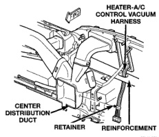
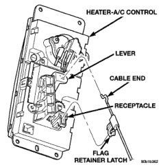
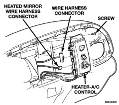

# REMOVAL AND INSTALLATION (Continued)

*Fig. 42 Heater-A/C Control Vacuum Harness Routing - Shows heater-A/C control vacuum harness, center distribution duct, retainer, and reinforcement]*

(4) Remove the cluster bezel from the instrument panel. Refer to Cluster Bezel in the Removal and Installation section of Group 8E - Instrument Panel Systems for the procedures.

(5) Remove the four screws that secure the heater-A/C control to the instrument panel (Fig. 43).

*Fig. 43 Heater-A/C Control Remove/Install - Shows heated mirror wire harness connector, wire harness connector, screw, and heater-A/C control]*

(6) Pull the heater-A/C control assembly away from the instrument panel far enough to access the connections on the back of the control.

(7) Unplug the wire harness connector from the back of the heater-A/C control.

(8) On vehicles with heated mirrors, unplug the heated mirror wire harness connector from the back of the heater-A/C control.

(9) Release the temperature control cable housing flag retainer latch in the receptacle on the back of the heater-A/C control and disengage the flag retainer from the receptacle (Fig. 44).

*Fig. 44 Heater-A/C Control Temperature Control Cable Remove/Install - Shows heater-A/C control, lever, cable end, receptacle, and flag retainer latch]*

(10) Rotate the heater-A/C control assembly as needed to disengage the cable end from the hole on the end of the temperature control lever.

(11) Remove the heater-A/C control from the instrument panel.

## INSTALLATION

(1) Connect the temperature control cable core end to the temperature control lever on the back of the heater-A/C control.

(2) Connect the temperature control cable housing flag retainer to the receptacle on the back of the heater-A/C control.

(3) Plug the wire harness connector(s) into the receptacle(s) on the back of the heater-A/C control.

(4) Route the heater-A/C vacuum harness through the hole in the reinforcement below the heater-A/C control opening of the instrument panel.

(5) Position the heater-A/C control in the instrument panel and secure it with four screws. Tighten the screws to 2.2 N·m (20 in. lbs.).

(6) Reinstall the cluster bezel to the instrument panel. Refer to Cluster Bezel in the Removal and Installation section of Group 8E - Instrument Panel Systems for the procedures.

(7) Reach under the instrument panel to reinstall the heater-A/C control vacuum harness retainer to the side of the center distribution duct.

*Source: 24 Heating and Air Conditioning, Page 37*
