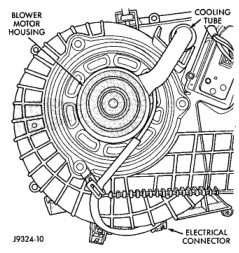
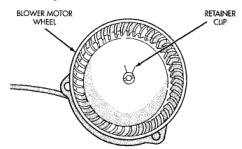

# REMOVAL AND INSTALLATION (Continued)

(8) Plug in the two halves of the heater-A/C control to heater-A/C housing vacuum harness connector.

(9) Connect the battery negative cable.

(10) Adjust the temperature control cable. See Temperature Control Cable in the Adjustments section of this group for the procedures.

## HEATER-A/C CONTROL KNOB

Each of the three heater-only or heater-A/C control knobs can be removed for service replacement.

(1) Rotate the control knob to its full clockwise position.

(2) Grasp the knob firmly and pull it straight out from the control.

(3) Reverse the removal procedures to install.

## BLOWER MOTOR

**WARNING: ON VEHICLES EQUIPPED WITH AIRBAGS, REFER TO GROUP 8M - PASSIVE RESTRAINT SYSTEMS BEFORE ATTEMPTING ANY STEERING WHEEL, STEERING COLUMN, OR INSTRUMENT PANEL COMPONENT DIAGNOSIS OR SERVICE. FAILURE TO TAKE THE PROPER PRECAUTIONS COULD RESULT IN ACCIDENTAL AIRBAG DEPLOYMENT AND POSSIBLE PERSONAL INJURY.**

## REMOVAL

(1) Disconnect and isolate the battery negative cable.

(2) Disconnect the blower motor cooling tube from the nipple on the blower motor housing (Fig. 45).

(3) Disengage the blower motor wire harness from the wire harness retainer.

(4) Unplug the blower motor wire harness connector from the heater-A/C housing wire harness.

(5) Remove the three screws that secure the blower motor and blower wheel assembly to the heater-A/C housing.

(6) Lower the blower motor and wheel from the heater-A/C housing.

(7) Remove the blower wheel retainer clip and remove the wheel from the blower motor shaft (Fig. 46).

## INSTALLATION

(1) Press the blower wheel hub onto the blower motor shaft. Be sure the flat on the blower motor shaft is indexed to the flat on the inside of the blower wheel hub.

(2) Install the retainer clip over the blower wheel hub. The ears of the retainer clip must be indexed over the flats on the blower motor shaft and blower wheel hub.

*Fig. 45 Blower Motor Remove/Install - Shows blower motor housing, cooling tube, and electrical connector]*

*Fig. 46 Blower Motor Wheel Remove/Install - Shows blower motor wheel and retainer clip]*

(3) Be certain that the blower motor seal is installed on the blower motor housing (Fig. 47).

(4) Install the blower motor in the heater-A/C housing with three mounting screws. Tighten the mounting screws to 2.2 N·m (20 in. lbs.).

(5) Plug the blower motor wire harness connector into the heater-A/C housing wire harness.

(6) Install the blower motor wire harness into the wire harness retainer.

(7) Connect the blower motor cooling tube to the nipple on the blower motor housing.

(8) Connect the battery negative cable.

*Source: 24 Heating and Air Conditioning, Page 38*
