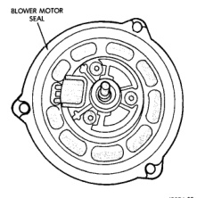
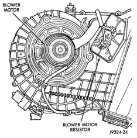
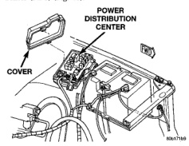

# REMOVAL AND INSTALLATION (Continued)

*Fig. 47 Blower Motor Seal - Shows blower motor seal location]*

## BLOWER MOTOR RELAY

(1) Disconnect and isolate the battery negative cable.

(2) Remove the cover from the Power Distribution Center (PDC) (Fig. 48).

*Fig. 48 Power Distribution Center - Shows power distribution center and cover]*

(3) Refer to the label on the PDC for blower motor relay identification and location.

(4) Unplug the blower motor relay from the PDC.

(5) Install the blower motor relay by aligning the relay terminals with the cavities in the PDC and pushing the relay firmly into place.

(6) Install the PDC cover.

(7) Connect the battery negative cable.

(8) Test the relay operation.

## BLOWER MOTOR RESISTOR

**WARNING: ON VEHICLES EQUIPPED WITH AIRBAGS, REFER TO GROUP 8M - PASSIVE RESTRAINT SYSTEMS BEFORE ATTEMPTING ANY STEERING WHEEL, STEERING COLUMN, OR INSTRUMENT PANEL COMPONENT DIAGNOSIS OR SERVICE. FAILURE TO TAKE THE PROPER PRECAUTIONS COULD RESULT IN ACCIDENTAL AIRBAG DEPLOYMENT AND POSSIBLE PERSONAL INJURY.**

## REMOVAL

(1) Disconnect and isolate the battery negative cable.

(2) Reach under the passenger side end of the heater-A/C housing and unplug the wire harness connector from the blower motor resistor.

(3) Remove the screws that secure the blower motor resistor to the heater-A/C housing.

(4) Remove the blower motor resistor from the heater-A/C housing (Fig. 49).

*Fig. 49 Blower Motor Resistor - Typical - Shows blower motor and blower motor resistor]*

## INSTALLATION

(1) Install the blower motor resistor into the heater-A/C housing and secure it with the mounting screws. Tighten the mounting screws to 2.2 N·m (20 in. lbs.).

(2) Plug the wire harness connector into the blower motor resistor.

(3) Connect the battery negative cable.

*Source: 24 Heating and Air Conditioning, Page 39*
