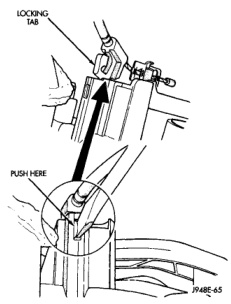

# REMOVAL AND INSTALLATION (Continued)

## TEMPERATURE CONTROL CABLE

The temperature control cable self-adjuster clip can be accessed and repositioned on the cable core without removal of the temperature control cable from the heater-A/C housing by reaching through the glove box opening as described in the Removal procedures that follow. Reposition the self-adjuster clip as shown in (Fig. 51), then see Temperature Control Cable in the Adjustments section of this group for the procedures to complete the cable adjustment.

**WARNING: ON VEHICLES EQUIPPED WITH AIRBAGS, REFER TO GROUP 8M - PASSIVE RESTRAINT SYSTEMS BEFORE ATTEMPTING ANY STEERING WHEEL, STEERING COLUMN, OR INSTRUMENT PANEL COMPONENT DIAGNOSIS OR SERVICE. FAILURE TO TAKE THE PROPER PRECAUTIONS COULD RESULT IN ACCIDENTAL AIRBAG DEPLOYMENT AND POSSIBLE PERSONAL INJURY.**

## REMOVAL

(1) Disconnect and isolate the battery negative cable.

(2) Remove the glove box from the instrument panel. Refer to Glove Box in the Removal and Installation section of Group 8E - Instrument Panel Systems for the procedures.

(3) Disconnect the temperature control cable from the heater-A/C control. See Heater-A/C Control in the Removal and Installation section of this group for the procedures.

(4) Reach through the instrument panel glove box opening to disconnect the temperature control cable housing flag retainer from the receptacle on the top of the heater-A/C housing (Fig. 50).

(5) Pull the temperature control cable core self-adjuster clip off of the pin on the end of the blend-air door lever.

(6) Remove the temperature control cable from the vehicle.

## INSTALLATION

Before installing the temperature control cable, be certain that the self-adjuster clip is properly positioned (Fig. 51). This measurement is made between the self-adjuster clip and the cable end on the heater-A/C housing end of the cable. If the self-adjuster clip is not properly positioned, slide the clip up or down the cable core as required to achieve the specified dimension.

(1) Push the temperature control cable core self-adjuster clip onto the pin on the end of the blend-air door lever.

*Fig. 51 Temperature Control Cable Remove/Install - Shows locking tab and push here indicator]*

(2) Snap the temperature control cable housing flag retainer into the receiver on the top of the heater-A/C housing.

(3) Reinstall the glove box in the instrument panel. Refer to Glove Box in the Removal and Installation section of Group 8E - Instrument Panel Systems for the procedures.

(4) Connect the temperature control cable to the heater-A/C control. See Heater-A/C Control in the Removal and Installation section of this group for the procedures.

(5) Connect the battery negative cable.

(6) Adjust the temperature control cable. See Temperature Control Cable in the Adjustments section of this group for the procedures.

## HEATER-A/C HOUSING

The heater-A/C housing assembly must be removed from the vehicle and disassembled for service access of the heater core, evaporator coil, and each of the various mode control doors.

*Source: 24 Heating and Air Conditioning, Page 40*
