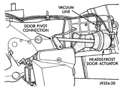

# REMOVAL AND INSTALLATION (Continued)

(4) Remove the remaining screws on the bottom of the heater-A/C housing that secure the two housing halves together.

(5) Place the heater-A/C housing right side up on the work bench.

(6) Separate the top half of the heater-A/C housing from the bottom half and set it aside.

## ASSEMBLY

(1) Position the top half of the heater-A/C housing over the bottom half. Be certain that the mode door pivot pins are properly inserted in their pivot holes.

(2) Place the heater-A/C housing upside down on the work bench.

(3) Install and tighten the screws on the bottom of the heater-A/C housing that secure the two housing halves together. Tighten the screws to 2.2 N·m (20 in. lbs.).

(4) Snap the center heat duct adaptor onto the bottom of the heater-A/C housing.

(5) Slide the floor duct onto the center heat duct adaptor and secure it with a screw to the bottom of the heater-A/C housing. Tighten the mounting screw to 2.2 N·m (20 in. lbs.).

(6) Reinstall the heater-A/C housing in the vehicle.

## INSTALLATION

(1) Position the heater-A/C housing to the dash panel. Be certain that the evaporator condensate drain tube and the housing mounting studs are inserted into their correct mounting holes.

(2) Install the nuts that secure the heater-A/C housing to the mounting studs on the passenger compartment side of the dash panel. Tighten the nuts to 4.5 N·m (40 in. lbs.).

(3) Install and tighten the nuts onto the heater-A/C housing mounting studs on the engine compartment side of the dash panel. Tighten the nuts to 7 N·m (60 in. lbs.).

(4) Unplug or remove the tape from the heater core tubes. Connect the heater hoses to the heater core tubes and fill the engine cooling system. Refer to Group 7 - Cooling System for the procedures.

(5) If the vehicle is not equipped with air conditioning, go to Step 10. If the vehicle is equipped with air conditioning, unplug or remove the tape from the accumulator inlet tube and the evaporator outlet tube fittings. Connect the accumulator inlet tube coupler to the evaporator outlet tube. See Refrigerant Line Coupler in the Removal and Installation section of this group for the procedures.

(6) Unplug or remove the tape from the liquid line and the evaporator inlet tube fittings. Connect the liquid line coupler to the evaporator inlet tube. See Refrigerant Line Coupler in the Removal and Installation section of this group for the procedures.

(7) Evacuate the refrigerant system. See Refrigerant System Evacuate in the Service Procedures section of this group.

(8) Charge the refrigerant system. See Refrigerant System Charge in the Service Procedures section of this group.

(9) Reinstall the PCM to the dash panel. Refer to Group 14 - Fuel Systems for the procedures.

(10) Reinstall the instrument panel in the vehicle. Refer to Instrument Panel Assembly in the Removal and Installation section of Group 8E - Instrument Panel Systems for the procedures.

(11) Connect the battery negative cable.

(12) Start the engine and check for proper operation of the heating and air conditioning systems.

## MODE DOOR VACUUM ACTUATOR

**WARNING: ON VEHICLES EQUIPPED WITH AIRBAGS, REFER TO GROUP 8M - PASSIVE RESTRAINT SYSTEMS BEFORE ATTEMPTING ANY STEERING WHEEL, STEERING COLUMN, OR INSTRUMENT PANEL COMPONENT DIAGNOSIS OR SERVICE. FAILURE TO TAKE THE PROPER PRECAUTIONS COULD RESULT IN ACCIDENTAL AIRBAG DEPLOYMENT AND POSSIBLE PERSONAL INJURY.**

### HEAT-DEFROST DOOR ACTUATOR

(1) Disconnect and isolate the battery negative cable.

(2) Remove the heater-A/C housing from the vehicle and place it on a work bench. See Heater-A/C Housing in the Removal and Installation section of this group for the procedures.

(3) Unplug the two vacuum harness connectors from the heat-defrost door actuator (Fig. 53).

*Fig. 53 Heat-Defrost Door Actuator - Shows vacuum line, door pivot connection, and heat-defrost door actuator]*

*Source: 24 Heating and Air Conditioning, Page 42*
