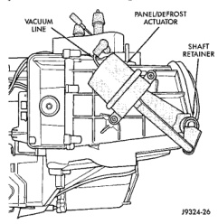
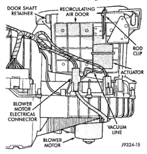

# REMOVAL AND INSTALLATION (Continued)

(4) Using a trim stick or another suitable wide flat-bladed tool, gently pry the heat-defrost door crank arm off of the heat-defrost door pivot.

(5) Remove the two screws that secure the heat-defrost door actuator to the heater-A/C housing.

(6) Remove the heat-defrost door actuator from the heater-A/C housing.

(7) Reverse the removal procedures to install. Tighten the heat-defrost door actuator mounting screws to 2.2 N·m (20 in. lbs.).

### PANEL-DEFROST DOOR ACTUATOR

(1) Disconnect and isolate the battery negative cable.

(2) Remove the instrument panel assembly from the vehicle. Refer to Instrument Panel Assembly in the Removal and Installation section of Group 8E - Instrument Panel Systems for the procedures.

(3) Unplug the vacuum harness connector from the panel-defrost door actuator (Fig. 54).

*Fig. 54 Panel-Defrost Door Actuator - Shows vacuum line, panel/defrost actuator, and shaft retainer]*

(4) Using a trim stick or another suitable wide flat-bladed tool, gently pry the panel-defrost door crank arm off of the panel-defrost door pivot.

(5) Remove the two screws that secure the panel-defrost door actuator to the heater-A/C housing.

(6) Remove the panel-defrost door actuator from the heater-A/C housing.

(7) Reverse the removal procedures to install. Tighten the panel-defrost door actuator mounting screws to 2.2 N·m (20 in. lbs.).

### RECIRCULATION AIR DOOR ACTUATOR

(1) Disconnect and isolate the battery negative cable.

(2) Remove the glove box from the instrument panel. Refer to Glove Box in the Removal and Installation section of Group 8E - Instrument Panel Systems for the procedures.

(3) Reach through the glove box opening to access and unplug the vacuum harness connector from the recirculation air door actuator (Fig. 55).

*Fig. 55 Recirculation Air Door Actuator - Shows door shaft retainer, recirculating air door, rod clip, actuator, blower motor electrical connector, blower motor, and vacuum line]*

(4) Loosen the two nuts on the studs that secure the recirculation air door actuator to the mounting bracket on the heater-A/C housing.

(5) Slide the two actuator mounting studs out of the slots in the actuator mounting bracket.

(6) Pull the recirculation actuator downward far enough to access the clip that retains the actuator link to the recirculation air door lever.

(7) Unsnap the clip from the recirculation actuator link and disengage the link from the recirculation air door lever.

(8) Remove the recirculation actuator from the heater-A/C housing.

(9) When reinstalling the recirculation actuator, insert a screwdriver or another suitable tool through the recirculation air intake grille to prop the recirculation air door up in the open position far enough to access the recirculation air door lever through the instrument panel glove box opening.

(10) Reverse the remaining removal procedures to install. Tighten the mounting nuts until the recirculation air door actuator is seated to the mounting bracket on the heater-A/C housing.

*Source: 24 Heating and Air Conditioning, Page 43*
