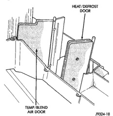

# REMOVAL AND INSTALLATION (Continued)

## HEATER-A/C HOUSING DOOR

**WARNING: ON VEHICLES EQUIPPED WITH AIRBAGS, REFER TO GROUP 8M - PASSIVE RESTRAINT SYSTEMS BEFORE ATTEMPTING ANY STEERING WHEEL, STEERING COLUMN, OR INSTRUMENT PANEL COMPONENT DIAGNOSIS OR SERVICE. FAILURE TO TAKE THE PROPER PRECAUTIONS COULD RESULT IN ACCIDENTAL AIRBAG DEPLOYMENT AND POSSIBLE PERSONAL INJURY.**

### BLEND-AIR DOOR

(1) Remove the heater-A/C housing from the vehicle, and disassemble the housing halves. See Heater-A/C Housing in the Removal and Installation section of this group for the procedures.

(2) Lift the blend-air door pivot shaft out of the pivot hole in the bottom of the heater-A/C housing (Fig. 56).

*Fig. 56 Blend-Air Door - Shows heat/defrost door and temp/blend air door]*

(3) Reverse the removal procedures to install.

### HEAT-DEFROST DOOR

(1) Remove the heat-defrost door actuator from the heater-A/C housing. See Mode Door Vacuum Actuator in the Removal and Installation section of this group for the procedures.

(2) Disassemble the heater-A/C housing halves. See Heater-A/C Housing in the Removal and Installation section of this group for the procedures.

(3) Remove the heat-defrost door from the heater-A/C housing.

(4) Reverse the removal procedures to install.

### PANEL-DEFROST DOOR

(1) Remove the panel-defrost door actuator from the heater-A/C housing. See Mode Door Vacuum Actuator in the Removal and Installation section of this group for the procedures.

(2) Remove the defroster and demister duct adapter from the heater-A/C housing. See Ducts and Outlets in the Removal and Installation section of this group for the procedures.

(3) Lift the panel-defrost door out of the top opening of the heater-A/C housing.

(4) Reverse the removal procedures to install.

### RECIRCULATION AIR DOOR

(1) Remove the heater-A/C housing from the vehicle. See Heater-A/C Housing in the Removal and Installation section of this group for the procedures.

(2) Unsnap the recirculation air door vacuum actuator link clip and disengage the link from the recirculation air door lever. See Mode Door Vacuum Actuators in the Removal and Installation section of this group for the procedures.

(3) Using a trim stick or another suitable wide flat-bladed tool, gently pry the retainer off of the recirculation air door pivot shaft.

(4) Remove the recirculation air door through the outside air intake opening on the top of the heater-A/C housing.

(5) Reverse the removal procedures to install.

## EVAPORATOR COIL

**WARNING: ON VEHICLES EQUIPPED WITH AIRBAGS, REFER TO GROUP 8M - PASSIVE RESTRAINT SYSTEMS BEFORE ATTEMPTING ANY STEERING WHEEL, STEERING COLUMN, OR INSTRUMENT PANEL COMPONENT DIAGNOSIS OR SERVICE. FAILURE TO TAKE THE PROPER PRECAUTIONS COULD RESULT IN ACCIDENTAL AIRBAG DEPLOYMENT AND POSSIBLE PERSONAL INJURY.**

## REMOVAL

(1) Remove the heater-A/C housing from the vehicle, and disassemble the housing halves. See Heater-A/C Housing in the Removal and Installation section of this group for the procedures.

(2) Lift the evaporator coil out of the heater-A/C housing (Fig. 57).

## INSTALLATION

(1) Insert the evaporator coil into the bottom of the heater-A/C housing.

*Source: 24 Heating and Air Conditioning, Page 44*
