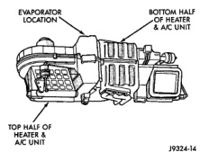
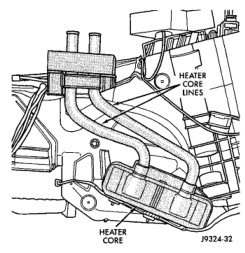

# REMOVAL AND INSTALLATION (Continued)

*Fig. 57 Evaporator Coil Location in Heater-A/C Housing (Upside Down) - Shows evaporator location, bottom half of heater & A/C unit, and top half of heater & A/C unit]*

(2) Reassemble and reinstall the heater-A/C housing in the vehicle. See Heater-A/C Housing in the Removal and Installation section of this group for the procedures.

**NOTE: If the evaporator is replaced, add 60 milliliters (2 fluid ounces) of refrigerant oil to the refrigerant system.**

## HEATER CORE

**WARNING: ON VEHICLES EQUIPPED WITH AIRBAGS, REFER TO GROUP 8M - PASSIVE RESTRAINT SYSTEMS BEFORE ATTEMPTING ANY STEERING WHEEL, STEERING COLUMN, OR INSTRUMENT PANEL COMPONENT DIAGNOSIS OR SERVICE. FAILURE TO TAKE THE PROPER PRECAUTIONS COULD RESULT IN ACCIDENTAL AIRBAG DEPLOYMENT AND POSSIBLE PERSONAL INJURY.**

## REMOVAL

(1) Remove the heater-A/C housing from the vehicle. See Heater-A/C Housing in the Removal and Installation section of this group for the procedures.

(2) Remove the screws and retainers that secure the heater core to the heater-A/C housing.

(3) Lift the heater core straight up and out of the heater-A/C housing (Fig. 58).

## INSTALLATION

(1) Lower the heater core into the heater-A/C housing.

(2) Position the retainers over the heater core tubes. Install and tighten the screws that secure the heater core and retainers to the heater-A/C housing. Tighten the screws to 2.2 N·m (20 in. lbs.).

*Fig. 58 Heater Core Remove/Install - Shows heater core lines and heater core]*

(3) Reinstall the heater-A/C housing in the vehicle. See Heater-A/C Housing in the Removal and Installation section of this group for the procedures.

## DUCTS AND OUTLETS

**WARNING: ON VEHICLES EQUIPPED WITH AIRBAGS, REFER TO GROUP 8M - PASSIVE RESTRAINT SYSTEMS BEFORE ATTEMPTING ANY STEERING WHEEL, STEERING COLUMN, OR INSTRUMENT PANEL COMPONENT DIAGNOSIS OR SERVICE. FAILURE TO TAKE THE PROPER PRECAUTIONS COULD RESULT IN ACCIDENTAL AIRBAG DEPLOYMENT AND POSSIBLE PERSONAL INJURY.**

## PANEL AND CENTER DISTRIBUTION DUCTS

The panel and center distribution ducts (Fig. 59) are only serviced as part of the instrument panel assembly. Refer to Instrument Panel Assembly in the Removal and Installation section of Group 8E - Instrument Panel Systems for the service procedures.

*Source: 24 Heating and Air Conditioning, Page 45*
