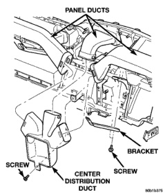
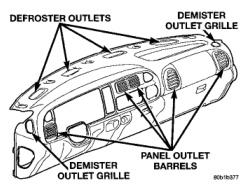

# REMOVAL AND INSTALLATION (Continued)

*Fig. 59 Panel and Center Distribution Ducts - Shows panel ducts, bracket, screw, and center distribution duct]*

## PANEL OUTLET BARRELS

**WARNING: THE PANEL OUTLET BARRELS INSTALLED IN THE PASSENGER SIDE AIRBAG DOOR PANEL OUTLET HOUSINGS MUST NEVER BE REINSTALLED FOLLOWING REMOVAL FOR ANY REASON. THEY MUST BE REPLACED WITH NEW BARRELS. FAILURE TO OBSERVE THIS WARNING COULD RESULT IN OCCUPANT INJURIES UPON AIRBAG DEPLOYMENT.**

(1) Using a trim stick or another suitable wide flat-bladed tool, gently pry near the center of either side of the panel outlet barrel to release the snap-fit pivots on the barrel from the pivot pins in the outlet housing of the passenger side airbag module or the instrument cluster bezel (Fig. 60).

(2) Remove the barrel from the panel outlet housing.

(3) To install a new panel outlet barrel, position the barrel in the outlet housing and press inwards firmly and evenly near the center of both sides of the panel outlet barrel until the pivots snap into place.

## DEMISTER OUTLET GRILLES

(1) Using a trim stick or another suitable wide flat-bladed tool, gently pry at the perimeter edges of the demister grille to release the snap features from the instrument panel top cover.

*Fig. 60 Panel Outlet Barrels - Shows defroster outlets, demister outlet grille, panel outlet barrels, and demister outlet grille]*

(2) Remove the demister grille from the instrument panel.

(3) To install the demister grille, position the grille in the opening of the instrument panel top cover and press inwards firmly and evenly near the center of both sides of the grille until it snaps into place.

## DEFROSTER AND DEMISTER DUCTS

The defroster duct and the main demister duct are a single molded plastic unit. The defroster outlet grilles are heat-staked to the defroster outlets and cannot be serviced separately. The demister tubes on each end of the main demister duct are only serviced in the instrument panel assembly.

(1) Remove the instrument panel top cover from the instrument panel. Refer to Instrument Panel Top Cover in the Removal and Installation section of Group 8E - Instrument Panel Systems for the procedures.

(2) Remove the screws that secure the defroster and demister ducts to the instrument panel brackets (Fig. 61).

(3) Disengage the demister tubes from each end of the main demister duct.

(4) Remove the defroster and demister duct unit from the instrument panel.

(5) Reverse the removal procedures to install. Tighten the mounting screws to 2.2 N·m (20 in. lbs.).

## DEFROSTER AND DEMISTER DUCT ADAPTER

(1) Roll the instrument panel assembly down, but do not remove it from the vehicle. Refer to Instrument Panel Assembly in the Removal and Installation section of Group 8E - Instrument Panel Systems for the procedures.

(2) Using a trim stick or another suitable wide flat-bladed tool, gently pry at the perimeter edges of the defroster and demister duct adapter to release

*Source: 24 Heating and Air Conditioning, Page 46*
