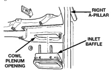
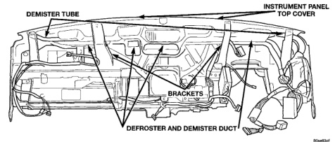
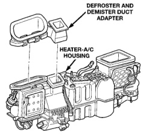

# REMOVAL AND INSTALLATION (Continued)

*Fig. 61 Defroster and Demister Duct Remove/Install - Shows demister tube, instrument panel top cover, brackets, and defroster and demister duct]*

the snap features from the top of the heater-A/C housing (Fig. 62).

*Fig. 62 Defroster and Demister Duct Adapter Remove/Install - Shows defroster and demister duct adapter and heater-A/C housing]*

(3) Remove the defroster and demister duct adapter from the top of the heater-A/C housing.

(4) Reverse the removal procedures to install.

## HEATER-A/C HOUSING INLET BAFFLE

(1) Remove the heater-A/C housing from the vehicle. See Heater-A/C Housing in the Removal and Installation section of this group for the procedures.

(2) Slide the heater-A/C housing inlet baffle (Fig. 63) all the way to one side of the cowl plenum opening.

*Fig. 63 Heater-A/C Housing Inlet Baffle Remove/Install - Shows right A-pillar, inlet baffle, and cowl plenum opening]*

(3) Pull downwards sharply and firmly on the opposite side of the heater-A/C housing inlet baffle to disengage the snap features from the cowl plenum opening.

(4) Remove the heater-A/C housing inlet baffle from the cowl plenum panel.

(5) When reinstalling the heater-A/C housing inlet baffle to the cowl plenum panel opening, be certain that the snap features on each side of the adapter are fully engaged with the sides of the plenum panel opening. This must be a water tight connection to prevent leaks.

(6) Reverse the remaining removal procedures to complete the installation.

*Source: 24 Heating and Air Conditioning, Page 47*
