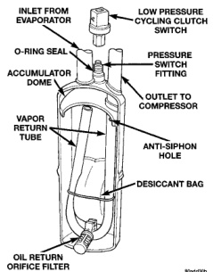

# DESCRIPTION AND OPERATION (Continued)

become trapped within the refrigerant system (Fig. 3).

*Fig. 3 Accumulator - Typical]*

## BLOWER MOTOR

The blower motor and blower wheel are located in the passenger side end of the heater-A/C housing, below the glove box. The blower motor controls the velocity of the air flowing through the heater-A/C housing by spinning a squirrel cage-type blower wheel within the housing at the selected speed. The blower motor and blower wheel can be serviced from the passenger compartment side of the housing.

The blower motor will only operate when the ignition switch is in the On position, and the heater-A/C mode control switch knob is in any position, except Off. The blower motor receives a fused battery feed through the blower motor relay whenever the ignition switch is in the On position.

The blower motor battery feed circuit is protected by a fuse in the Power Distribution Center (PDC). The blower motor relay control circuit is protected by a fuse in the junction block. Blower motor speed is controlled by regulating the ground path through the heater-A/C mode control switch, the blower motor switch, and the blower motor resistor.

The blower motor and blower wheel cannot be repaired and, if faulty or damaged, they must be replaced. The blower motor and blower wheel are each serviced separately.

## BLOWER MOTOR RELAY

The blower motor relay is a International Standards Organization (ISO)-type relay. The relay is a electromechanical device that switches battery current from a fuse in the Power Distribution Center (PDC) directly to the blower motor. The relay is energized when the relay coil is provided a voltage signal by the ignition switch. This arrangement reduces the amount of battery current that must flow through the ignition switch.

The blower motor relay control circuit is protected by a fuse located in the junction block. When the relay is de-energized, the blower motor receives no battery current. See Blower Motor Relay in the Diagnosis and Testing section of this group for more information.

The blower motor relay is located in the PDC in the engine compartment. Refer to the PDC label for blower motor relay identification and location.

The blower motor relay cannot be repaired and, if faulty or damaged, it must be replaced.

## BLOWER MOTOR RESISTOR

The blower motor resistor is mounted to the bottom of the heater-A/C housing, under the instrument panel and just inboard of the blower motor. It can be accessed without removing any other components.

The resistor has multiple resistor wires, each of which will change the resistance in the blower motor ground path to change the blower motor speed. The blower motor switch directs the ground path through the correct resistor wire to obtain the selected blower motor speed.

With the blower motor switch in the lowest speed position, the ground path for the motor is applied through all of the resistor wires. Each higher speed selected with the blower motor switch applies the blower motor ground path through fewer of the resistor wires, increasing the blower motor speed. When the blower motor switch is in the highest speed position, the blower motor resistor is bypassed and the blower motor receives a direct path to ground.

The blower motor resistor cannot be repaired and, if faulty or damaged, it must be replaced.

## BLOWER MOTOR SWITCH

The heater-only or heater-A/C blower motor is controlled by a four position rotary-type blower motor switch, mounted in the heater-A/C control panel. The switch allows the selection of one of four blower motor speeds, but can only be turned off by selecting the Off position with the heater-A/C mode control switch knob.

*Source: 24 Heating and Air Conditioning, Page 5*
