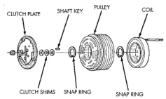

# DESCRIPTION AND OPERATION (Continued)

The blower motor switch directs the blower motor ground path through the mode control switch to the blower motor resistor, or directly to ground, as required to achieve the selected blower motor speed.

The blower motor switch cannot be repaired and, if faulty or damaged, the entire heater-only or heater-A/C control unit must be replaced. The blower motor switch knob is serviced separately.

## COMPRESSOR

The air conditioning system uses a Sanden SD7H15 seven cylinder, reciprocating wobble plate-type compressor on all models. This compressor has a fixed displacement of 150 cubic centimeters (9.375 cubic inches), and has both the suction and discharge ports located on the cylinder head. A label identifying the use of R-134a refrigerant is located on the compressor.

The compressor is driven by the engine through an electric clutch, drive pulley and belt arrangement. The compressor is lubricated by refrigerant oil that is circulated throughout the refrigerant system with the refrigerant.

The compressor draws in low-pressure refrigerant vapor from the evaporator through its suction port. It then compresses the refrigerant into a high-pressure, high-temperature refrigerant vapor, which is then pumped to the condenser through the compressor discharge port.

The compressor cannot be repaired. If faulty or damaged, the entire compressor assembly must be replaced. The compressor clutch, pulley and clutch coil are available for service.

## COMPRESSOR CLUTCH

The compressor clutch assembly consists of a stationary electromagnetic coil, a hub bearing and pulley assembly, and a clutch plate (Fig. 4). The electromagnetic coil unit and the hub bearing and pulley assembly are each retained on the nose of the compressor front housing with snap rings. The clutch plate is mounted to the compressor shaft and secured with a nut.

*Fig. 4 Compressor Clutch - Typical]*

These components provide the means to engage and disengage the compressor from the engine serpentine accessory drive belt. When the clutch coil is energized, it magnetically draws the clutch into contact with the pulley and drives the compressor shaft. When the coil is not energized, the pulley freewheels on the clutch hub bearing, which is part of the pulley. The compressor clutch and coil are the only serviced parts on the compressor.

The compressor clutch engagement is controlled by several components: the heater-A/C mode control switch, the low pressure cycling clutch switch, the high pressure cut-off switch, the compressor clutch relay, and the Powertrain Control Module (PCM). The PCM may delay compressor clutch engagement for up to thirty seconds. Refer to Group 14 - Fuel System for more information on the PCM controls.

## COMPRESSOR CLUTCH RELAY

The compressor clutch relay is a International Standards Organization (ISO) micro-relay. The terminal designations and functions are the same as a conventional ISO relay. However, the micro-relay terminal orientation (footprint) is different, the current capacity is lower, and the relay case dimensions are smaller than those of the conventional ISO relay.

The compressor clutch relay is a electromechanical device that switches battery current to the compressor clutch coil when the Powertrain Control Module (PCM) grounds the coil side of the relay. The PCM responds to inputs from the heater-A/C mode control switch, the low pressure cycling clutch switch, and the high pressure cut-off switch. See Compressor Clutch Relay in the Diagnosis and Testing section of this group for more information.

The compressor clutch relay is located in the Power Distribution Center (PDC) in the engine compartment. Refer to the PDC label for relay identification and location.

The compressor clutch relay cannot be repaired and, if faulty or damaged, it must be replaced.

## CONDENSER

The condenser is located in the air flow in front of the engine cooling radiator. The condenser is a heat exchanger that allows the high-pressure refrigerant gas being discharged by the compressor to give up its heat to the air passing over the condenser fins. When the refrigerant gas gives up its heat, it condenses. When the refrigerant leaves the condenser, it has become a high-pressure liquid refrigerant.

The volume of air flowing over the condenser fins is critical to the proper cooling performance of the air

*Source: 24 Heating and Air Conditioning, Page 6*
