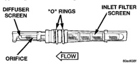

# DESCRIPTION AND OPERATION (Continued)

conditioning system. Therefore, it is important that there are no objects placed in front of the radiator grille openings in the front of the vehicle or foreign material on the condenser fins that might obstruct proper air flow. Also, any factory-installed air seals or shrouds must be properly reinstalled following radiator or condenser service.

The condenser cannot be repaired and, if faulty or damaged, it must be replaced.

## EVAPORATOR COIL

The evaporator coil is located in the heater-A/C housing, under the instrument panel. The evaporator coil is positioned in the heater-A/C housing so that all air that enters the housing must pass over the fins of the evaporator before it is distributed through the system ducts and outlets. However, air passing over the evaporator coil fins will only be conditioned when the compressor is engaged and circulating refrigerant through the evaporator coil tubes.

Refrigerant enters the evaporator from the fixed orifice tube as a low-temperature, low-pressure liquid. As air flows over the fins of the evaporator, the humidity in the air condenses on the fins, and the heat from the air is absorbed by the refrigerant. Heat absorption causes the refrigerant to boil and vaporize. The refrigerant becomes a low-pressure gas before it leaves the evaporator.

The evaporator coil cannot be repaired and, if faulty or damaged, it must be replaced.

## FIXED ORIFICE TUBE

The fixed orifice tube is installed in the liquid line between the outlet of the condenser and the inlet of the evaporator. The fixed orifice tube is only serviced as an integral part of the liquid line.

The inlet end of the fixed orifice tube has a nylon mesh filter screen, which filters the refrigerant and helps to reduce the potential for blockage of the metering orifice by refrigerant system contaminants (Fig. 5). The outlet end of the tube has a nylon mesh diffuser screen. The O-rings on the plastic body of the fixed orifice tube seal the tube to the inside of the liquid line and prevent the refrigerant from bypassing the fixed metering orifice.

*Fig. 5 Fixed Orifice Tube - Typical]*

The fixed orifice tube is used to meter the flow of liquid refrigerant into the evaporator coil. The high-pressure liquid refrigerant from the condenser expands into a low-pressure liquid as it passes through the metering orifice and diffuser screen of the fixed orifice tube.

The fixed orifice tube cannot be repaired and, if faulty or plugged, the liquid line assembly must be replaced.

## HEATER CORE

The heater core is located in the heater-A/C housing, under the instrument panel. It is a heat exchanger made of rows of tubes and fins. Engine coolant is circulated through heater hoses to the heater core at all times. As the coolant flows through the heater core, heat removed from the engine is transferred to the heater core fins and tubes.

Air directed through the heater core picks up the heat from the heater core fins. The blend air door allows control of the heater output air temperature by controlling how much of the air flowing through the heater-A/C housing is directed through the heater core. The blower motor speed controls the volume of air flowing through the heater-A/C housing.

The heater core cannot be repaired and, if faulty or damaged, it must be replaced. Refer to Group 7 - Cooling System for more information on the engine cooling system, the engine coolant and the heater hoses.

## HIGH PRESSURE CUT-OFF SWITCH

The high pressure cut-off switch is located on the discharge line near the compressor. The switch is screwed onto a fitting that contains a Schrader-type valve, which allows the switch to be serviced without discharging the refrigerant system. The discharge line fitting is equipped with an O-ring to seal the switch connection.

The high pressure cut-off switch is connected in series electrically with the low pressure cycling clutch switch between ground and the Powertrain Control Module (PCM). The switch contacts open and close causing the PCM to turn the compressor clutch on and off. This prevents compressor operation when the discharge line pressure approaches high levels.

The high pressure cut-off switch contacts are open when the discharge line pressure rises above about 3100 to 3375 kPa (450 to 490 psi). The switch contacts will close when the discharge line pressure drops to about 1860 to 2275 kPa (270 to 330 psi). When checking refrigerant system pressures with a manifold gauge set, keep in mind that the indicated pressures will be about 172 kPa (25 psi) below the actual switch pressure values due to the pressure

*Source: 24 Heating and Air Conditioning, Page 7*
