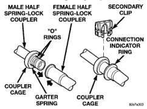

# DESCRIPTION AND OPERATION (Continued)

High pressures are produced in the refrigerant system when the air conditioning compressor is operating. Extreme care must be exercised to make sure that each of the refrigerant system connections is pressure-tight and leak free. It is a good practice to inspect all flexible hose refrigerant lines at least once a year to make sure they are in good condition and properly routed.

The refrigerant lines and hoses cannot be repaired and, if faulty or damaged, they must be replaced.

## REFRIGERANT LINE COUPLER

Spring-lock type refrigerant line couplers are used to connect many of the refrigerant lines and other components to the refrigerant system. These couplers require a special tool for disengaging the two coupler halves.

The spring-lock coupler is held together by a garter spring inside a circular cage on the male half of the fitting (Fig. 6). When the two coupler halves are connected, the flared end of the female fitting slips behind the garter spring inside the cage on the male fitting. The garter spring and cage prevent the flared end of the female fitting from pulling out of the cage.

*Fig. 6 Spring-Lock Coupler - Typical]*

Two O-rings on the male half of the fitting are used to seal the connection. These O-rings are compatible with R-134a refrigerant and must be replaced with O-rings made of the same material.

Secondary clips are installed over the two connected coupler halves at the factory for added blow-off protection. In addition, a plastic ring is used at the factory as a visual indicator to confirm that these couplers are connected. After the coupler is connected, the plastic indicator ring is no longer needed; however, it will remain on the refrigerant line near the coupler cage.

## REFRIGERANT OIL

The refrigerant oil used in R-134a refrigerant systems is a synthetic-based, PolyAlkylene Glycol (PAG), wax-free lubricant. Mineral-based R-12 refrigerant oils are not compatible with PAG oils, and should never be introduced to an R-134a refrigerant system.

There are different PAG oils available, and each contains a different additive package. The SD7H15 compressor used in this vehicle is designed to use an SP-20 PAG refrigerant oil. Use only refrigerant oil of this same type to service the refrigerant system.

After performing any refrigerant recovery or recycling operation, always replenish the refrigerant system with the same amount of the recommended refrigerant oil as was removed. Too little refrigerant oil can cause compressor damage, and too much can reduce air conditioning system performance.

PAG refrigerant oil is much more hygroscopic than mineral oil, and will absorb any moisture it comes into contact with, even moisture in the air. The PAG oil container should always be kept tightly capped until it is ready to be used. After use, recap the oil container immediately to prevent moisture contamination.

## REFRIGERANT SYSTEM SERVICE EQUIPMENT

**WARNING: EYE PROTECTION MUST BE WORN WHEN SERVICING AN AIR CONDITIONING REFRIGERANT SYSTEM. TURN OFF (ROTATE CLOCKWISE) ALL VALVES ON THE EQUIPMENT BEING USED, BEFORE CONNECTING TO OR DISCONNECTING FROM THE REFRIGERANT SYSTEM. FAILURE TO OBSERVE THESE WARNINGS MAY RESULT IN PERSONAL INJURY.**

When servicing the air conditioning system, a R-134a refrigerant recovery/recycling/charging station that meets SAE Standard J2210 must be used. Contact an automotive service equipment supplier for refrigerant recovery/recycling/charging equipment. Refer to the operating instructions supplied by the equipment manufacturer for the proper care and use of this equipment.

A manifold gauge set may be needed with some recovery/recycling/charging equipment (Fig. 7). The service hoses on the gauge set being used should have manual (turn wheel), or automatic back-flow valves at the service port connector ends. This will prevent refrigerant from being released into the atmosphere.

**CAUTION: Do not use an R-12 manifold gauge set on an R-134a system. The refrigerants are not compatible and system damage will result.**

## MANIFOLD GAUGE SET CONNECTIONS

*Source: 24 Heating and Air Conditioning, Page 9*
