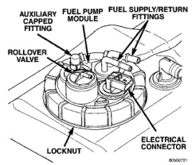
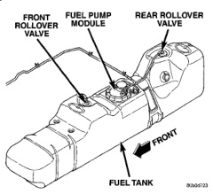
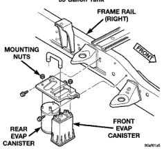
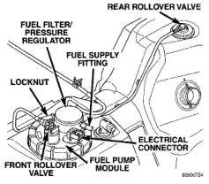

# BR EMISSION CONTROL SYSTEMS 25-15

## DESCRIPTION AND OPERATION (Continued)

*Fig. 1 Rollover Valve Location—Diesel Powered]*

*Fig. 2 Rollover Valve Locations—Gas Powered with 26 or 34 Gallon Tank]*

### EVAPORATIVE (EVAP) CANISTER

Two, maintenance free, EVAP canisters are used with all 3.9L/5.2L/5.9L/8.0L gasoline powered engines. Both canisters are mounted to a bracket located below rear of vehicle cab on outside of right frame rail (Fig. 4). The EVAP canisters are filled with granules of an activated carbon mixture. Fuel vapors entering the EVAP canisters are absorbed by the charcoal granules.

Fuel tank pressure vents into the EVAP canisters. Fuel vapors are temporarily held in the canisters until they can be drawn into the intake manifold. The duty cycle EVAP canister purge solenoid allows the EVAP canisters to be purged at predetermined times and at certain engine operating conditions.

*Fig. 3 Rollover Valve Locations—Gas Powered with 35 Gallon Tank]*

*Fig. 4 Location of EVAP Canisters]*

### DUTY CYCLE EVAP CANISTER PURGE SOLENOID

All 3.9L/5.2L/5.9L/8.0L gasoline powered engines use a duty cycle EVAP canister purge solenoid. The solenoid regulates the rate of vapor flow from the EVAP canister to the throttle body. The PCM operates the solenoid.

During the cold start warm-up period and the hot start time delay, the PCM does not energize the solenoid. When de-energized, no vapors are purged. The PCM de-energizes the solenoid during open loop operation.

The engine enters closed loop operation after it reaches a specified temperature and the time delay ends. During closed loop operation, the PCM energizes and de-energizes the solenoid 5 or 10 times per

---
*Source: Chapter 25, Page 15*
