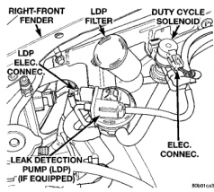
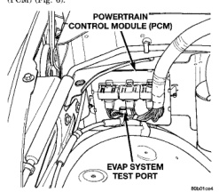

# 25-16 EMISSION CONTROL SYSTEMS BR

## DESCRIPTION AND OPERATION (Continued)

second, depending upon operating conditions. The PCM varies the vapor flow rate by changing solenoid pulse width. Pulse width is the amount of time the solenoid energizes. The PCM adjusts solenoid pulse width based on engine operating condition.

The solenoid attaches to a bracket mounted to the right inner fender (Fig. 5).

*Fig. 5 EVAP Canister Purge Solenoid and LDP Location]*

### LEAK DETECTION PUMP (LDP)

The Leak Detection Pump (LDP) is used only with certain emission packages. The LDP and LDP filter are located in the engine compartment on the right inner fender (Fig. 5). The EVAP system test port is located in front of the Powertrain Control Module (PCM) (Fig. 6).

*Fig. 6 EVAP System Test Port Location]*

The LDP is a device used to detect a leak in the evaporative system.

The pump contains a 3 port solenoid, a pump that contains a switch, a spring loaded canister vent valve seal, 2 check valves and a spring/diaphragm.

Immediately after a cold start, engine temperature between 40°F and 86°F, the 3 port solenoid is briefly energized. This initializes the pump by drawing air into the pump cavity and also closes the vent seal. During non-test conditions, the vent seal is held open by the pump diaphragm assembly which pushes it open at the full travel position. The vent seal will remain closed while the pump is cycling. This is due to the operation of the 3 port solenoid which prevents the diaphragm assembly from reaching full travel. After the brief initialization period, the solenoid is de-energized, allowing atmospheric pressure to enter the pump cavity. This permits the spring to drive the diaphragm which forces air out of the pump cavity and into the vent system. When the solenoid is energized and de-energized, the cycle is repeated creating flow in typical diaphragm pump fashion. The pump is controlled in 2 modes:

**PUMP MODE:** The pump is cycled at a fixed rate to achieve a rapid pressure build in order to shorten the overall test time.

**TEST MODE:** The solenoid is energized with a fixed duration pulse. Subsequent fixed pulses occur when the diaphragm reaches the switch closure point.

The spring in the pump is set so that the system will achieve an equalized pressure of about 7.5 inches of water.

When the pump starts, the cycle rate is quite high. As the system becomes pressurized pump rate drops. If there is no leak the pump will quit. If there is a leak, the test is terminated at the end of the test mode.

If there is no leak, the purge monitor is run. If the cycle rate increases due to the flow through the purge system, the test is passed and the diagnostic is complete.

The canister vent valve will unseal the system after completion of the test sequence as the pump diaphragm assembly moves to the full travel position.

### POSITIVE CRANKCASE VENTILATION (PCV) SYSTEM

All 3.9L V-6 and 5.2L/5.9L V-8 gas powered engines are equipped with a closed crankcase ventilation system and a positive crankcase ventilation (PCV) valve. The 8.0L V-10 engine is not equipped with a PCV valve. Refer to Crankcase Ventilation System—8.0L V-10 Engine for information.

This system consists of a PCV valve mounted on the cylinder head (valve) cover with a hose extending from the valve to the intake manifold. Another hose connects the opposite cylinder head (valve) cover to the air cleaner housing to provide a source of clean air for the system. A separate crankcase breather/filter is not used.

---
*Source: Chapter 25, Page 16*
