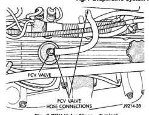
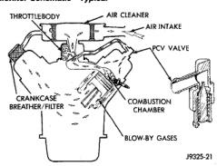

# BR EMISSION CONTROL SYSTEMS 25-17

## DESCRIPTION AND OPERATION (Continued)

*Fig. 8 Evaporative System Monitor Schematic—Typical]*

*Fig. 9 PCV Valve/Hose—Typical]*

The PCV system operates by engine intake manifold vacuum (Fig. 9). Filtered air is routed into the crankcase through the air cleaner hose. The metered air, along with crankcase vapors, are drawn through the PCV valve and into a passage in the intake manifold. The PCV system manages crankcase pressure and meters blow by gases to the intake system, reducing engine sludge formation.

*Fig. 9 Typical Closed Crankcase Ventilation System]*

The PCV valve contains a spring loaded plunger. This plunger meters the amount of crankcase vapors routed into the combustion chamber based on intake manifold vacuum.

When the engine is not operating or during an engine pop-back, the spring forces the plunger back against the seat. This will prevent vapors from flowing through the valve.

---
*Source: Chapter 25, Page 17*
