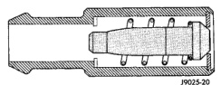
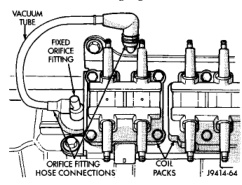
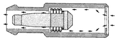
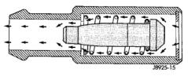

# 25-18 EMISSION CONTROL SYSTEMS BR

## DESCRIPTION AND OPERATION (Continued)

*Fig. 10 Engine Off or Engine Pop-Back—No Vapor Flow]*

During periods of high manifold vacuum, such as idle or cruising speeds, vacuum is sufficient to completely compress spring. It will then pull the plunger to the top of the valve (Fig. 11). In this position there is minimal vapor flow through the valve.

*Fig. 11 High Intake Manifold Vacuum—Minimal Vapor Flow]*

During periods of moderate manifold vacuum, the plunger is only pulled part way back from inlet. This results in maximum vapor flow through the valve (Fig. 12).

*Fig. 12 Moderate Intake Manifold Vacuum—Maximum Vapor Flow]*

### CRANKCASE VENTILATION SYSTEM—8.0L V-10 ENGINE

The 8.0L V-10 engine is equipped with a Crankcase Ventilation (CCV) system. The CCV system performs the same function as a conventional PCV system, but does not use a vacuum controlled valve (PCV valve).

A molded vacuum tube connects manifold vacuum to the top of the right cylinder head (valve) cover. The vacuum tube connects to a fixed orifice fitting (Fig. 13) of a calibrated size 2.6 mm (0.10 inches). It meters the amount of crankcase vapors drawn out of the engine. The fixed orifice fitting is grey in color. A similar fitting (but does not contain a fixed orifice) is used on the left cylinder head (valve) cover. This fitting is black in color. Do not interchange these two fittings.

When the engine is operating, fresh air enters the engine and mixes with crankcase vapors. Manifold vacuum draws the vapor/air mixture through the fixed orifice and into the intake manifold. The vapors are then consumed during engine combustion.

*Fig. 13 Fixed Orifice Fitting—8.0L V-10 Engine—Typical]*

### CRANKCASE BREATHER/FILTER

The crankcase breather/filter is no longer used with the 3.9L, 5.2L or 5.9L engine.

### VEHICLE EMISSION CONTROL INFORMATION (VECI) LABEL

Vehicles equipped with 3.9L V-6 or 5.2L/5.9L V-8 LDC-gas powered engines have a VECI label.

The label combines both emission control information and vacuum hose routing. This label is located in the engine compartment in front of the radiator (Fig. 14) and contains the following:

- Engine family and displacement
- Evaporative family
- Emission control system schematic
- Certification application
- Engine timing specifications (if adjustable)
- Idle speeds (if adjustable)
- Spark plug and gap

The 5.9L HDC-gas powered engine will have two labels. One of the labels is located in front of the radiator in the engine compartment (Fig. 14) and will contain vacuum hose routing only. The other is attached to the drivers side of the engine air cleaner housing (Fig. 14) and will contain the following:

- Engine family and displacement
- Evaporative family
- Certification application

---
*Source: Chapter 25, Page 18*
