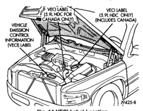
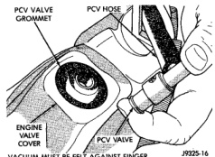
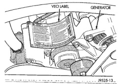
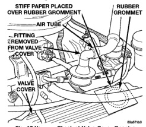

# BR EMISSION CONTROL SYSTEMS 25-19

## DESCRIPTION AND OPERATION (Continued)

*Fig. 15 VECI Label Locations]*

- Engine timing specifications (if adjustable)
- Idle speeds (if adjustable)
- Spark plug and gap

The label for the 8.0L V-10 HDC-gas powered engine is also located in the engine compartment. It is attached to a riveted metal plate located to the right side of the generator (Fig. 15).

*Fig. 16 VECI Label Location—8.0L V-10 Engine]*

There are unique labels for vehicles built for sale in the country of Canada and for both Light Duty Cycle (LDC) and Heavy Duty Cycle (HDC) engines. Canadian labels are written in both the English and French languages. For all Canadian vehicles, the label is split into two different labels.

The VECI labels are permanently attached and cannot be removed without defacing information and destroying label.

---

## DIAGNOSIS AND TESTING

### PCV VALVE TEST—3.9/5.2/5.9L ENGINE

(1) With engine idling, remove the PCV valve from cylinder head (valve) cover. If the valve is not plugged, a hissing noise will be heard as air passes through the valve. Also, a strong vacuum should be felt at the valve inlet (Fig. 16).

*Fig. 17 Vacuum Check at PCV Valve Inlet]*

(2) Return the PCV valve into the valve cover. Remove the fitting and air hose at the opposite valve cover. Loosely hold a piece of stiff paper, such as a parts tag, over the opening (rubber grommet) at the valve cover (Fig. 17).

*Fig. 18 Vacuum Check at Valve Cover Opening]*

---
*Source: Chapter 25, Page 19*
