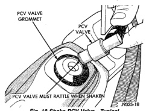
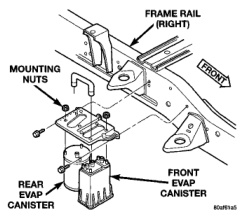

# 25-20 EMISSION CONTROL SYSTEMS BR

## DIAGNOSIS AND TESTING (Continued)

(3) The paper should be drawn against the opening in the valve cover with noticeable force. This will be after allowing approximately one minute for crankcase pressure to reduce.

(4) Turn engine off and remove PCV valve from valve cover. The valve should rattle when shaken (Fig. 18).

*Fig. 18 Shake PCV Valve—Typical]*

(5) Replace the PCV valve and retest the system if it does not operate as described in the preceding tests. Do not attempt to clean the old PCV valve.

(6) If the paper is not held against the opening in valve cover after new valve is installed, the PCV valve hose may be restricted and must be replaced. The passage in the intake manifold must also be checked and cleaned.

(7) To clean the intake manifold fitting, turn a 1/4 inch drill (by hand) through the fitting to dislodge any solid particles. Blow out the fitting with shop air. If necessary, use a smaller drill to avoid removing any metal from the fitting.

### VACUUM SCHEMATICS

A vacuum schematic for emission related items can be found on the VECI label. Refer to Vehicle Emission Control Information (VECI) Label in this group for label location.

### LEAK DETECTION PUMP (LDP)

Refer to the appropriate Powertrain Diagnostic Procedures service manual for LDP testing procedures.

---

## REMOVAL AND INSTALLATION

### EVAPORATIVE (EVAP) CANISTER

Two EVAP canisters are used. Both canisters are mounted to a bracket located below rear of vehicle cab on outside of right frame rail (Fig. 19).

#### REMOVAL

(1) Remove fuel tubes/lines at each EVAP canister. Note location of tubes/lines before removal for easier installation.

*Fig. 19 EVAP Canister Location]*

(2) Remove mounting nuts at each canister (Fig. 19).

(3) Remove each canister from mounting bracket.

#### INSTALLATION

(1) Place each canister to mounting bracket (Fig. 19).

(2) Install nuts and tighten to 9 N-m (80 in. lbs.) torque.

(3) Install fuel tubes/lines to each canister.

### DUTY CYCLE EVAP CANISTER PURGE SOLENOID

The duty cycle solenoid is attached to a bracket mounted to the right inner fender (Fig. 20).

#### REMOVAL

(1) Disconnect electrical wiring connector at solenoid (Fig. 20).

(2) Disconnect vacuum harness at solenoid.

(3) Remove solenoid from support bracket.

#### INSTALLATION

(1) Install solenoid assembly to support bracket.

(2) Connect vacuum harness.

(3) Connect wiring connector.

### ROLLOVER VALVE(S)

> **WARNING: THE FUEL SYSTEM IS UNDER A CONSTANT PRESSURE (EVEN WITH THE ENGINE OFF). BEFORE SERVICING THE ROLLOVER VALVE, FUEL SYSTEM PRESSURE MUST BE RELEASED (GASOLINE POWERED ENGINES ONLY). REFER TO THE FUEL PRESSURE RELEASE PROCEDURE IN GROUP 14, FUEL SYSTEM.**

---
*Source: Chapter 25, Page 20*
