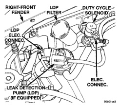
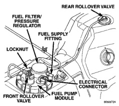
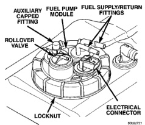
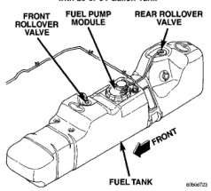

# BR EMISSION CONTROL SYSTEMS 25-21

## REMOVAL AND INSTALLATION (Continued)

*Fig. 20 Duty Cycle EVAP Canister Purge Solenoid Location]*

*Fig. 21 Rollover Valve Location—Diesel Powered]*

(1) **Diesel Powered Engine:** One rollover valve is used. The valve is located on top of fuel tank module (Fig. 21) and may be serviced separately.

- (a) Disconnect both negative battery cables at both batteries.
- (b) Remove fuel filler cap and drain fuel tank.
- (c) Remove fuel tank. Refer to Fuel Tank Removal/Installation in Group 14, Fuel System.
- (d) The rollover valve is seated into a rubber grommet. Remove valve by prying one side upward and then roll valve out of grommet.
- (e) Discard old grommet.

(2) **Gasoline Powered Engines:** If equipped with a 26 or 34 gallon fuel tank, two rollover valves are used. One of the valves is permanently mounted to

*Fig. 22 Rollover Valve Locations—Gas Powered with 26 or 34 Gallon Tank]*

*Fig. 23 Rollover Valve Locations—Gas Powered with 35 Gallon Tank]*

top of fuel tank (Fig. 22). If replacement of this particular valve is necessary, fuel tank must be replaced. Refer to Fuel Tank Removal/Installation in Group 14, Fuel System. The other rollover valve is located on top of fuel pump module (Fig. 22). This valve may be serviced separately. Refer to following steps for procedures.

If equipped with a 35 gallon fuel tank, two rollover valves are also used, but both valves are permanently mounted to top of fuel tank (Fig. 23). If replacement is necessary, fuel tank must be replaced. Refer to Fuel Tank Removal/Installation in Group 14, Fuel System.

---
*Source: Chapter 25, Page 21*
