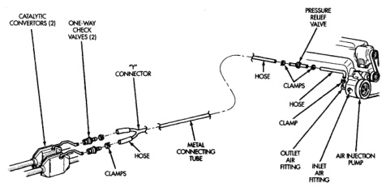

# BR EMISSION CONTROL SYSTEMS 25-23

## AIR INJECTION SYSTEM—HDC GAS ENGINES

### INDEX

| GENERAL INFORMATION | page | REMOVAL AND INSTALLATION | page |
|---------------------|------|-------------------------|------|
| GENERAL INFORMATION | 23 | AIR INJECTION PUMP AIR FILTER—8.0L V-10 ENGINE | 26 |
| **DESCRIPTION AND OPERATION** | | AIR INJECTION PUMP | 25 |
| AIR INJECTION PUMP | 24 | ONE-WAY CHECK VALVE | 25 |
| AIR INJECTION SYSTEM OPERATION | 23 | **SPECIFICATIONS** | |
| ONE-WAY CHECK VALVE | 25 | TORQUE CHART | 26 |
| **DIAGNOSIS AND TESTING** | | | |
| TESTING ONE-WAY CHECK VALVE | 25 | | |

---

## GENERAL INFORMATION

The air injection system (Fig. 1), (Fig. 2) or (Fig. 3) is used on 5.9L V-8 and 8.0L V-10 heavy duty cycle (HDC) gas powered engines only. The air injection system consists of:

- A belt-driven air injection (AIR) pump
- Two air pressure relief valves
- Rubber connecting air injection hoses with clamps
- Metal connecting air tubes
- Two one-way check valves
- A replaceable injection pump air filter (8.0L V-10 engine only)

---

## DESCRIPTION AND OPERATION

### AIR INJECTION SYSTEM OPERATION

The air injection system adds a controlled amount of air to the exhaust gases aiding oxidation of hydrocarbons and carbon monoxide in the exhaust stream. The system does not interfere with the ability of the EGR system (if used) to control nitrous oxide (NOx) emissions.

**5.9L HDC ENGINE:** Air is drawn into the pump through a rubber tube that is connected to a fitting on the air cleaner housing (Fig. 2).

**8.0L V-10 ENGINE:** Air is drawn into the pump through a rubber tube that is connected to a fitting

*Fig. 1 Air Injection System Components—Typical]*

---
*Source: Chapter 25, Page 23*
