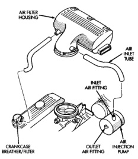
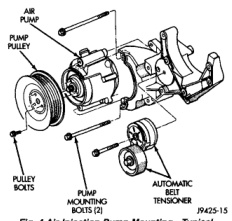
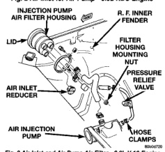

# 25-24 EMISSION CONTROL SYSTEMS — BR

## DESCRIPTION AND OPERATION (Continued)

*Fig. 2 Air Inlet for Air Pump—5.9L HDC Engine]*

*Fig. 3 Air Inlet and Air Pump Air Filter—8.0L V-10 Engine]*

on the air injection pump filter housing (Fig. 3). Air is drawn into the filter housing from the front of the vehicle with rubber tube. This tube is used as a silencer to help prevent air intake noise at the opening to the pump filter housing. An air filter is located within the air pump filter housing (Fig. 3).

Air is then compressed by the air injector pump. It is expelled from the pump and routed into a rubber tube where it reaches the air pressure relief valve (Fig. 1). Pressure relief holes in the relief valve will prevent excess downstream pressure. If excess downstream pressure occurs at the relief valve, it will be vented into the atmosphere.

Air is then routed (Fig. 1) from the relief valve, through a tube, down to a "Y" connector, through the two one-way check valves and injected at both of the catalytic converters (referred to as downstream).

The two one-way check valves (Fig. 1) protect the hoses, air pump and injection tubes from hot exhaust gases backing up into the system. Air is allowed to flow through these valves in one direction only (towards the catalytic converters).

Downstream air flow assists the oxidation process in the catalyst, but does not interfere with EGR operation (if EGR system is used).

## AIR INJECTION PUMP

The air pump is mounted on the front of the engine and driven by a belt connected to the crankshaft pulley (Fig. 4).

*Fig. 4 Air Injection Pump Mounting—Typical]*

The air injection system is not completely noiseless. Under normal conditions, noise rises in pitch as engine speed increases. To determine if excessive noise is fault of air injection system, disconnect drive belt and operate engine.

**CAUTION: Do not attempt to lubricate the air injection pump. Oil in the pump will cause rapid deterioration and failure.**

Refer to the AIR PUMP DIAGNOSIS chart for additional information.

---
*Source: Chapter 25 Emission Control Systems, Page 24*
