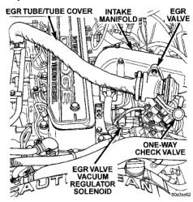
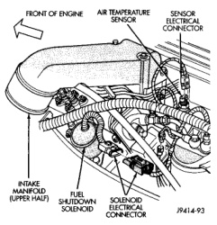
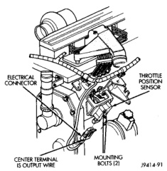
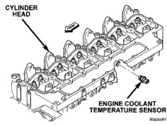

# 25-28 EMISSION CONTROL SYSTEMS — BR

## DESCRIPTION AND OPERATION (Continued)

- A quick-release one-way check valve (Fig. 1) to provide a fast release of engine vacuum from EGR valve diaphragm when EGR system is shut down.

- Vacuum lines and hoses to connect the various components.

*Fig. 1 EGR Valve and Components]*

*Fig. 2 Engine Coolant Temperature Sensor Location]*

When the PCM supplies a ground signal to the EGR valve vacuum regulator solenoid, EGR system operation starts to occur. The PCM will monitor and determine when to supply and remove this ground signal. This will depend on inputs from the engine coolant temperature, throttle position and intake manifold air temperature sensors.

When the ground signal is supplied to the EGR solenoid, vacuum from the vacuum pump will be

*Fig. 3 Intake Manifold Air Temperature Sensor Location—Typical]*

*Fig. 4 Throttle Position Sensor Location—Typical]*

allowed to pass through the EGR solenoid and on to the EGR valve with a connecting hose.

Exhaust gas recirculation will begin in this order when:

- The engine is running to operate the vacuum pump.

- The powertrain control module (PCM) determines that engine coolant temperature is more than

---
*Source: Chapter 25 Emission Control Systems, Page 28*
